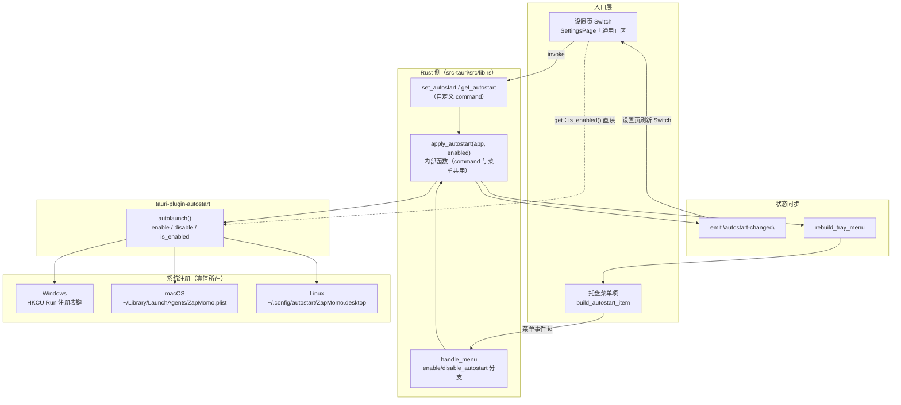
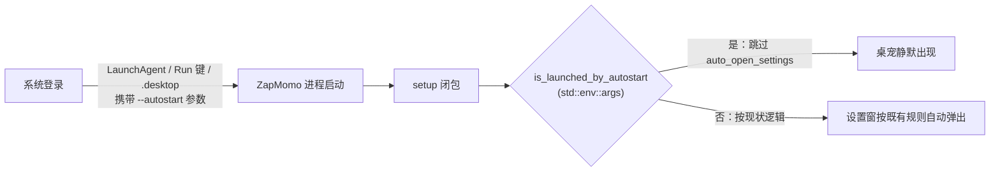

# ZapMomo 开机自启动技术方案

> 状态：待审核
> 日期：2026-08-21
> 范围：`src-tauri`（zapmomo-app）新增开机自启动能力 + 配套 single-instance 防双实例

---

## 1. 背景与目标

### 1.1 需求描述

用户可在应用内开启「开机自启动」：系统登录时自动拉起 ZapMomo，桌宠直接出现在桌面上，**设置窗口不自动弹出**（静默启动）。手动启动应用的行为保持不变。

### 1.2 目标

| # | 目标 | 验收口径 |
| --- | --- | --- |
| G1 | 设置页「通用」区提供「开机自启动」开关 | 开关状态与系统注册状态一致 |
| G2 | 托盘菜单提供同款入口 | 与设置页状态双向同步 |
| G3 | 自启动拉起时桌宠静默出现 | 设置窗不自动弹出；手动启动仍按现状 |
| G4 | 防双实例 | 自启常驻后再手动点图标，激活已有实例而非拉起第二个桌宠 |
| G5 | 三平台可用 | Windows（exe/msi）、macOS（dmg arm64/x64）、Linux（deb/rpm），与 `release.yml` 发布矩阵一致 |

### 1.3 非目标

- 不提供「自启动但以托盘模式静默运行（不显示桌宠）」的细分级选项（后续可扩展启动参数实现）；
- 不修正既有的 `auto_open_settings` 注释与代码方向不一致问题（见 2.2，建议另行 issue）；
- 不在右键菜单加入口（自启动为低频设置项，设置页 + 托盘两入口已足够）。

---

## 2. 现状分析

### 2.1 应用现状

- 应用为 Tauri 2 桌面桌宠（workspace 成员 `zapmomo-app`），当前已接入插件：`tauri-plugin-dialog`、`tauri-plugin-global-shortcut`（`src-tauri/Cargo.toml:26-29`）；macOS 侧另有 `tauri-nspanel`（非激活面板）。
- 前端（`src-tauri/frontend/`，React 19 + Vite）通过 `src/lib/tauri.ts` 的 `api` 对象统一 invoke 自定义 command（L62-203），事件经 `onXxx` 包装订阅（L205-374）。前端**没有任何** `@tauri-apps/plugin-*` 直接依赖。
- 代码中不存在任何自启动相关实现（全库检索无 `autostart` 命中）。

### 2.2 关键现状问题

**P1：启动 2 秒后自动打开设置窗口。** `src-tauri/src/lib.rs:4446-4458`：

```rust
#[cfg(target_os = "macos")]
let auto_open_settings = !hide_dock_icon;
#[cfg(not(target_os = "macos"))]
let auto_open_settings = true;
```

该段注释称「仅用于无全局菜单栏的场景（macOS Accessory 模式或非 macOS）」，但代码行为是 macOS Regular 模式（未隐藏 Dock 图标）才弹、Accessory 不弹——**注释与代码方向相反**（PR #54 引入的遗留问题）。若不处理，自启动在非 macOS 上每次开机都会弹出设置窗口，与 G3 冲突。

本方案的处理原则：**不修正既有方向**（修正会改变存量用户的手动启动体验，属独立行为变更），仅在其上叠加「自启动拉起时不弹」的条件。

**P2：无 single-instance 防护。** 应用可被重复拉起。开启自启动后应用开机常驻，用户再手动点击图标必然触发第二实例——两个桌宠、两份 KWS 监听、两份托盘。G4 要求配套解决。

### 2.3 现有可复用模式（均已核实）

本项目近期功能（#127 层级切换、#131 位置锁定）已沉淀出一套稳定的「设置类功能」接入模式，本方案完全沿用：

| 模式 | 锚点 | 说明 |
| --- | --- | --- |
| `apply_*` 内部函数 | `apply_companion_locked`，lib.rs:2361-2369 | command 与原生菜单事件共用同一内部函数：生效 → `emit` 事件 → `rebuild_tray_menu` |
| get/set command 对 | `get/set_hide_dock_icon`，lib.rs:2545-2575 | 设置页经自定义 command 读写，不暴露插件权限（global-shortcut 同款，Cargo.toml:28 注释明示此约定） |
| 按状态显示的普通 MenuItem | `build_locked_item`，lib.rs:2745-2766 | **刻意不用 CheckMenuItem**（其 checked 自动取反与 apply 叠加净效果为零，lib.rs:2720-2725 注释记录了该坑）；按当前状态显示相反动作的普通菜单项，点击应用幂等固定值 |
| 托盘菜单重建 | `build_tray_menu` / `rebuild_tray_menu`，lib.rs:2642-2678 | `tray_by_id(TRAY_ID)` 定位后整体重建，刷新菜单项文案 |
| 菜单事件分发 | `handle_menu`，lib.rs:2578-2610 | 内联字符串 id 统一分发（app 菜单 / 托盘 / 右键三类菜单共用） |
| 设置页 Switch 行 | `SettingsPage.tsx`「通用」section L176-231 | dl/dt/dd 行布局；「隐藏应用图标」行为最佳参照（挂载加载 L59-64、乐观更新 + 失败回滚 L109-112） |
| 前端事件订阅 | `SettingsPage.tsx` L78-106 | `useEffect` 内 `onXxx` 订阅，清理时 resolve unlisten |
| Rust 纯函数测试 | lib.rs 末尾 `#[cfg(test)] mod xxx_tests`（样例 4569-4593） | 只测纯函数，command/菜单不单测，由手动验收覆盖 |
| 前端测试 | `SettingsPage.test.tsx` L8-38 | `vi.hoisted` mock `@tauri-apps/api/core` + `event`，`listenHandlers` Map 捕获后可主动推送事件；**不 mock `lib/tauri.ts`**（真实包装层被测试覆盖） |

---

## 3. 架构分析

### 3.1 目标架构



开机拉起链路（G3 静默启动）：



### 3.2 关键设计决策与评估

#### D1：状态源 = 系统真值，不落盘 TOML

**评估过的两个选项：**

| 选项 | 说明 | 结论 |
| --- | --- | --- |
| A. 仿 `hide_dock_icon` 落盘 settings.rs | load → 改字段 → save → apply | ✗ 弃用 |
| B. 系统注册状态为唯一真值 | get 直读 `is_enabled()`，set 直调 enable/disable | ✓ 采用 |

选 B 的依据：

1. `hide_dock_icon` 落盘的根因是它是**进程内行为**（macOS ActivationPolicy），进程退出即失效，必须落盘供下次启动恢复；自启动是**系统级注册**（注册表键 / plist / .desktop 文件），不随应用退出消失，**天然无需启动恢复**，落盘没有消费方；
2. 用户可在系统设置外部增删自启动项（Windows 任务管理器「启动应用」、macOS 系统设置 > 通用 > 登录项、Linux 删除 .desktop 文件）。若落盘副本，外部改动后即 desync，托盘文案与设置页开关会显示错误状态；直读真值则永远一致；
3. `is_enabled()` 底层是单次本地文件存在性检查（macOS/Linux）或注册表单键读取（Windows），仅被 `get_autostart` command 与 `rebuild_tray_menu` 调用，频率极低，**无需缓存**。

代价与接受理由：与项目「设置类功能均落盘」的惯例存在差异，须在代码注释中显式说明（见 4.2），避免后续维护者误「补齐」落盘。

#### D2：交互通道 = Rust 侧自定义 command（不暴露插件给前端）

沿用 global-shortcut 的既有约定（`Cargo.toml:28` 注释：「Rust 侧注册与分发；设置页经自定义 command 间接操作」）：

- 前端**不**安装 `@tauri-apps/plugin-autostart`，`capabilities/default.json` **不**新增插件权限（自定义 command 走 `core:default` 即可调用）；
- 收益：权限面最小化；invoke 命令名/参数/事件名收敛在 `lib/tauri.ts` 一处；测试 mock 面与现有 SettingsPage.test 完全一致（只 mock `@tauri-apps/api/core` 与 `event`）。

#### D3：自启动静默启动 = 启动参数 `--autostart`

- 插件注册时通过 `init(MacosLauncher::LaunchAgent, Some(vec!["--autostart"]))` 附加参数，系统拉起时进程命令行携带该参数；
- setup 内以纯函数 `is_launched_by_autostart(std::env::args())` 检测（精确匹配，`--autostart-x` / `autostart` 不命中）；
- 选 `std::env::args` 而非 tauri `Args`：项目未引入 cli 插件，std 足够且可作纯函数单测；
- 副作用评估：用户在终端手动带 `--autostart` 启动同样静默——幂等且无害，接受。

#### D4：防双实例 = tauri-plugin-single-instance

- 官方要求**注册为第一个插件**；
- 回调在**已有实例**内执行（签名 `|app, args, cwd|`），第二进程自行退出；
- 回调行为：companion 窗口若处于隐藏状态则恢复显示（复用 `toggle_companion_window` lib.rs:2856 的 Windows 置底层级压回修复），随后 `show_settings_window(app)`（show + focus）。理由：用户手动点图标的意图是「找到应用」，companion 是 skip_taskbar 的非激活 NSPanel，不适合作为聚焦目标，前置设置窗是可发现的落点；
- 无 JS API，无需 capabilities 变更；Linux 侧经 DBus（服务名由 identifier 派生为 `org.com_zapmomo.SingleInstance`），zbus 为纯 Rust 实现，不引入新系统库，CI 无影响。

### 3.3 平台机制对照

| 平台 | 注册方式 | 用户可见/可管理位置 | 备注 |
| --- | --- | --- | --- |
| Windows | 注册表 `HKCU\Software\Microsoft\Windows\CurrentVersion\Run` | 任务管理器 > 启动应用 | 企业策略可能禁写，enable 报错走前端回滚 |
| macOS | LaunchAgent `~/Library/LaunchAgents/ZapMomo.plist` | 系统设置 > 通用 > 登录项 | 选 `MacosLauncher::LaunchAgent`（AppleScript 变体依赖 osascript，无必要） |
| Linux | `~/.config/autostart/ZapMomo.desktop` | 桌面会话自启 | deb/rpm 安装路径稳定，无 AppImage 路径漂移问题 |

注册文件名/键名均取 productName「ZapMomo」，与 `[[bin]]` 改名后的可执行名一致（Cargo.toml:16-18）。

---

## 4. 技术方案

### 4.1 依赖变更

| 文件 | 变更 |
| --- | --- |
| `src-tauri/Cargo.toml` | `[dependencies]` 在 global-shortcut 之后新增两行 |

```toml
# 开机自启动（LaunchAgent / Run 键 / XDG .desktop，Rust 侧经自定义 command 操作）
tauri-plugin-autostart = "2"

# 单实例防护：自启常驻后手动再点图标激活已有实例，而非拉起第二个桌宠
tauri-plugin-single-instance = "2"
```

**不改动**：`capabilities/default.json`（D2）、根 crate `src/config/settings.rs`（D1 不落盘）、前端 `package.json`（无新 npm 依赖）、`tauri.conf.json`、右键菜单 `build_companion_menu`（非目标）。

### 4.2 Rust 侧改动明细（均在 `src-tauri/src/lib.rs`）

**R1. Builder 链（L4134 起）**

```rust
tauri::Builder::default()
    // single-instance 必须注册为第一个插件（官方要求）。
    .plugin(tauri_plugin_single_instance::init(|app, _args, _cwd| {
        // 第二实例拉起时在已有实例内执行：恢复可能隐藏的桌宠，前置设置窗。
        // ...（companion 隐藏则 show，复用 toggle_companion_window 的层级压回修复；
        //     随后 show_settings_window(app)）
    }))
    .plugin(tauri_plugin_dialog::init())
    .plugin(tauri_plugin_global_shortcut::Builder::new().build())
    .plugin(tauri_plugin_autostart::init(
        MacosLauncher::LaunchAgent,
        Some(vec!["--autostart"]),
    ))
```

（single-instance 回调体在阶段 3 才落地，阶段 1 不引入。）

**R2. 纯函数与状态读取（`set_hide_dock_icon` L2575 之后）**

```rust
/// 自启动拉起检测：命令行精确携带 `--autostart`（注册自启动时由插件附加）。
/// `--autostart-x` / `autostart` 等前缀/去杠变体不命中。
fn is_launched_by_autostart<I>(args: I) -> bool
where
    I: IntoIterator,
    I::Item: AsRef<str>,
{
    args.into_iter().any(|a| a.as_ref() == "--autostart")
}

/// 托盘自启动菜单项的 (id, 文案)，按当前状态显示相反动作（非 CheckMenuItem，
/// 与 build_locked_item 同理：checked 自动取反与 apply 叠加净效果为零）。
fn autostart_item_labels(enabled: bool) -> (&'static str, &'static str) {
    if enabled {
        ("disable_autostart", "关闭开机自启动")
    } else {
        ("enable_autostart", "开机自启动")
    }
}

/// 读当前自启动状态。注意：与 hide_dock_icon 等落盘开关不同，自启动是系统级
/// 注册（不随退出消失、用户可在系统设置外部增删），系统状态即唯一真值，
/// 不在 settings.toml 落盘，get 直读插件。
fn current_autostart_enabled(app: &AppHandle) -> bool {
    use tauri_plugin_autostart::ManagerExt; // 函数内 use，避开 nspanel 同名 trait
    app.autolaunch().is_enabled().unwrap_or(false)
}

/// 设置并生效开机自启动（内部实现，供 command 与原生菜单事件共用）。
fn apply_autostart(app: &AppHandle, enabled: bool) -> Result<(), String> {
    use tauri_plugin_autostart::ManagerExt;
    if enabled {
        app.autolaunch()
            .enable()
            .map_err(|e| format!("开启开机自启动失败（写入系统启动项被拒）：{e}"))?;
    } else {
        app.autolaunch()
            .disable()
            .map_err(|e| format!("关闭开机自启动失败（移除系统启动项被拒）：{e}"))?;
    }
    let _ = app.emit("autostart-changed", enabled);
    rebuild_tray_menu(app);
    Ok(())
}
```

**R3. command 对（仿 `get/set_hide_dock_icon`）**

```rust
#[tauri::command]
fn get_autostart(app: AppHandle) -> Result<bool, String> {
    Ok(current_autostart_enabled(&app))
}

#[tauri::command]
fn set_autostart(app: AppHandle, enabled: bool) -> Result<(), String> {
    apply_autostart(&app, enabled)
}
```

**R4. 菜单接入**

- `build_autostart_item`（`build_locked_item` L2766 之后）：普通 `MenuItem::with_id`，id/文案取自 `autostart_item_labels(current_autostart_enabled(app))`；
- `build_tray_menu`（L2642-2666）：`&autostart,` 插在 `&locked,` 与 `&open_settings,` 之间（角色行为组之后、应用级操作「打开设置/重启/退出」之前）；
- `handle_menu`（L2578-2610）追加分支：

```rust
"enable_autostart" => { let _ = apply_autostart(app, true); }
"disable_autostart" => { let _ = apply_autostart(app, false); }
```

**R5. invoke_handler（L4241 `set_hide_dock_icon` 之后）**：追加 `get_autostart, set_autostart,`。

**R6. setup 静默启动（L4448-4451）**

```rust
// setup 早期计算一次；自启动拉起（--autostart）时不自动弹设置窗，桌宠静默出现。
let launched_by_autostart = is_launched_by_autostart(std::env::args());
#[cfg(target_os = "macos")]
let auto_open_settings = !hide_dock_icon && !launched_by_autostart;
#[cfg(not(target_os = "macos"))]
let auto_open_settings = !launched_by_autostart;
```

### 4.3 前端侧改动明细

**F1. `src-tauri/frontend/src/lib/tauri.ts`**

- `api` 对象（L194 `setHideDockIcon` 之后）：

```ts
getAutostart: () => invoke<boolean>("get_autostart"),
setAutostart: (args: { enabled: boolean }) => invoke<void>("set_autostart", args),
```

- 事件包装（L288 `onCompanionLockedChanged` 之后，设置页为唯一订阅者）：

```ts
export function onAutostartChanged(handler: (enabled: boolean) => void): Promise<UnlistenFn> {
  return listen<boolean>("autostart-changed", (e) => handler(e.payload));
}
```

**F2. `src-tauri/frontend/src/pages/SettingsPage.tsx`「通用」section**

- state：`const [autostart, setAutostart] = useState(false);`
- 挂载加载（对齐 hideDockIcon L59-64）：`void api.getAutostart().then(setAutostart).catch(() => {});`
- 事件订阅（对齐 L78-106 模式）：`onAutostartChanged` → `setAutostart`（托盘菜单改动后同步开关）；
- handler（乐观更新 + 失败回滚，对齐 L109-112）：

```tsx
const handleToggleAutostart = useCallback((enabled: boolean) => {
  setAutostart(enabled);
  void api.setAutostart({ enabled }).catch(() => setAutostart((prev) => !prev));
}, []);
```

- UI 行（「隐藏应用图标」L210 之后、「重启应用」之前，dl/dt/dd 布局）：

```tsx
<div className="flex items-center justify-between gap-3.5 px-3.5 py-2.5">
  <div className="min-w-0">
    <dt className="text-sm text-text-primary">开机自启动</dt>
    <dd className="mt-0.5 text-xs text-text-muted">登录系统后自动启动 ZapMomo，桌宠静默出现</dd>
  </div>
  <Switch aria-label="开机自启动" checked={autostart} onCheckedChange={handleToggleAutostart} />
</div>
```

---

## 5. 实施方案（分阶段）

> 每阶段独立可合入、可验收；阶段顺序经过依赖排序：先核心能力（后端 + 托盘已可完整使用），再 UI 便利入口，再防护，最后文档与跨平台确认。
> single-instance 放阶段 3 而非阶段 1 的原因：双实例防护会干扰阶段 1/2 的「注销重登验证」（防止旧实例残留干扰），先验证核心链路再做防护。

### 阶段 1：Rust 后端 + 托盘入口

**任务**：R2、R3、R4、R5、R6 + Builder 链注册 autostart 插件（R1 的 autostart 部分）+ `autostart_tests` 测试模块。

**测试**（lib.rs 末尾新 `mod autostart_tests`，仿 `companion_locked_tests` L4569-4593）：

- `is_launched_by_autostart`：参数尾部命中、参数中段命中；边界不命中——空迭代器、仅可执行路径、`--autostart-x`、`autostart`、`--autostart=1`；
- `autostart_item_labels`：false → `("enable_autostart", "开机自启动")`，true → `("disable_autostart", "关闭开机自启动")`。

**验收**：

1. `cargo fmt --check && cargo clippy -p zapmomo-app -- -D warnings && cargo test -p zapmomo-app` 全绿；
2. `pnpm tauri dev`：托盘菜单出现「开机自启动」→ 点击 → macOS 系统设置 > 通用 > 登录项出现 ZapMomo；托盘文案翻转为「关闭开机自启动」；再点关闭 → 登录项消失；
3. 开启状态下注销重新登录：桌宠出现，设置窗**不**弹出；手动正常启动（不带参数）：设置窗按既有规则弹出（行为未变）；
4. **验收完毕必须关闭开关**（dev 注册的是 `target/debug/ZapMomo`，见风险 1）。

### 阶段 2：前端设置页

**任务**：F1、F2 + SettingsPage.test.tsx 补测。

**测试**（沿用 vi.hoisted mock 结构；`beforeEach` 的 `invokeMock.mockImplementation` switch 中补 `case "get_autostart"` 分支，防 default undefined）：

- 默认 off + 点击 → `invokeMock` 收到 `("set_autostart", { enabled: true })`；
- 恢复 on（mock 返回 true）后点击 → `{ enabled: false }`；
- `set_autostart` reject → 开关回滚；
- `act(() => listenHandlers.get("autostart-changed")?.(true))` 推送 → Switch `aria-checked` 同步为 true（托盘改动的镜像验证）。

**验收**：

1. `pnpm --dir src-tauri/frontend test:run && pnpm --dir src-tauri/frontend check && pnpm --dir src-tauri/frontend build` 全绿；
2. 手动：设置页开关 ↔ 托盘菜单双向同步（两边任一改动，另一边状态即时一致）；get 断言与系统登录项一致。

### 阶段 3：single-instance

**任务**：R1 的 single-instance 部分（Builder 首位注册 + 回调激活已有实例）。

**验收**：

1. Rust 三连（同阶段 1 命令 1）全绿；
2. dev 运行中直接再跑一个 `target/debug/ZapMomo`：第二进程自动退出，第一实例设置窗弹到前台；若桌宠此前被隐藏则同时恢复；
3. 回归三个重启入口（设置页 / 右键 / 托盘的「重启」）在单实例下正常（macOS restart 为 exec 同进程替换，预期无冲突，需实证）；
4. 注意 dev 模式下不可并发两个 `pnpm tauri dev`（会互斥属预期）。

### 阶段 4：文档 + 三平台验收

**任务**：README 功能说明区（L85 附近）加「开机自启动」条目；workspace 全量质量门 + 三平台手动验收。

**验收**：

1. 全量：`cargo fmt --check && cargo clippy -- -D warnings && cargo test`（workspace）+ 前端三连；
2. macOS（本地打包版 `pnpm tauri build` 产物）全量清单：登录项管理可见、注销重登静默、双开激活已有实例、hide_dock_icon + autostart 组合（Accessory 静默）正常；
3. Windows：注册表 Run 键写入正确（`reg query`）/ 任务管理器启动应用可见；Linux：`~/.config/autostart/ZapMomo.desktop` 存在且 Exec 指向安装路径——两者可用 CI release 草稿产物验证或交由用户自测，结果记录于 PR 描述。

---

## 6. 风险与注意事项

| # | 风险 | 缓解 |
| --- | --- | --- |
| 1 | **dev 模式注册 debug 路径**：注册项指向 `target/debug/ZapMomo`，cargo clean / 仓库移动后悬空失效 | dev 验收后必关；残留清理：手动删 `~/Library/LaunchAgents/ZapMomo.plist`（Windows 删 Run 键、Linux 删 .desktop） |
| 2 | Windows 企业策略禁写 Run 键 | enable 失败文案已覆盖；前端乐观更新 + reject 回滚兜底 |
| 3 | invoke_handler / Builder 链是多 PR 热区（历史 squash 遮蔽教训，见 #77/#88） | 合并前 `git fetch` 并 diff main，确认无并行改动冲突 |
| 4 | `auto_open_settings` 注释与代码方向相反（PR #54 遗留） | 本方案只叠加 `!launched_by_autostart` 不修正方向；建议另行 issue 确认预期行为 |
| 5 | single-instance 回调时序（极早期注册，manage 的状态可能未就绪） | 回调只做窗口 show/focus，不触碰 managed state；阶段 3 专项回归 |
| 6 | Linux DBus 服务名 `org.com_zapmomo.SingleInstance` 与其他应用冲突概率 | identifier 唯一派生，冲突概率可忽略；异常时表现为第二实例直接退出，无功能损坏 |

---

## 7. 评估过程说明

为避免实施期返工，本方案在编写阶段完成了以下验证：

1. **插件 API 源码级确认**：`tauri_plugin_autostart::init(MacosLauncher, Option<Vec<&'static str>>)` 签名、`ManagerExt::autolaunch()` 三方法、`MacosLauncher` 仅 LaunchAgent/AppleScript 两变体；single-instance 回调 `|app, args, cwd|` 在已有实例内执行、官方要求首位注册、无 JS API。
2. **全部代码锚点实读核实**：lib.rs 的 Builder 链、apply 样板、菜单构建/分发、setup 建窗与 auto_open 逻辑、测试模块组织；前端 tauri.ts 封装层、SettingsPage 通用 section、测试 mock 结构；settings.rs 持久化 API 与顶层开关样板。文中 file:line 均对应当前 main（82ef2382）。
3. **git 历史核查**：`auto_open_settings` 方向不一致问题溯源至 PR #54，确认为遗留而非近期回归，支撑「不修正、只叠加」的决策。
4. **性能确认**：`is_enabled()` 为单次本地文件/注册表检查，调用点仅 get command 与托盘重建，无需缓存设计。
5. **平台机制对照发布矩阵**：三平台注册机制与 `release.yml` 产物一一对应；无 AppImage（无路径漂移风险）；zbus 纯 Rust（无 CI 新系统库依赖）。
