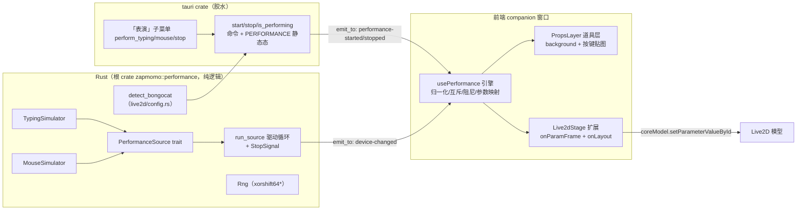
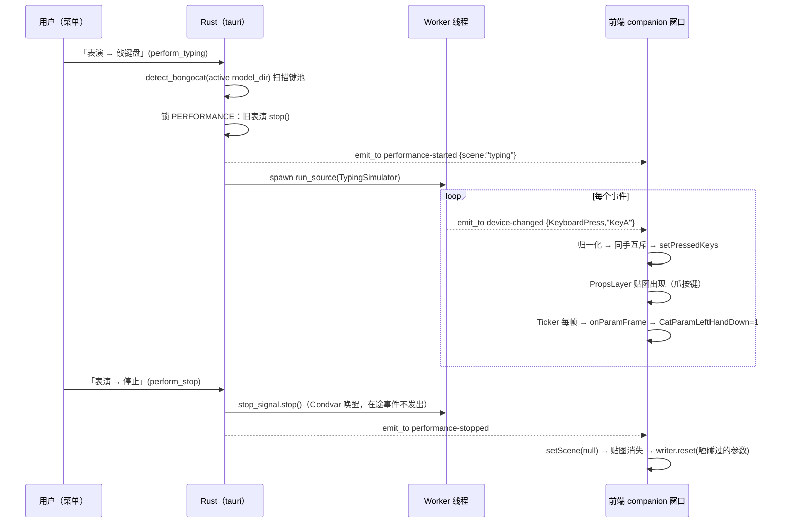

# BongoCat 兼容表演系统 · 技术方案

> 状态：待评审
> 日期：2026-08-21
> 范围：仅一期（本方案），不含 AI 代理接入（架构留口，另行立项）

## 1. 背景与目标

### 1.1 需求

让桌宠 Live2D 模型「自己动起来」，复刻 [BongoCat](https://github.com/ayangweb/BongoCat)（MIT，Tauri 2 同类应用）的打字与鼠标操作效果：

- **完全兼容 BongoCat 格式约定**：用户从 [Awesome-BongoCat](https://github.com/ayangweb/Awesome-BongoCat) 社区（50+ 模型，zip 分发）下载的模型目录可直接导入 ZapMomo 使用；
- **绝不监听用户真实键鼠**：所有事件由**模拟器**生成（随机打字流、随机鼠标轨迹）。无 rdev 依赖、无 macOS 输入监控权限诉求；
- 表演由用户**手动点播**（右键/托盘菜单「表演」子菜单），无空闲自动触发；
- 仅 BongoCat 格式伙伴可表演，普通 cubism 伙伴菜单置灰；
- 不内置预设模型（社区模型许可不统一，用户自行下载导入）。

### 1.2 与 BongoCat 的本质差异

BongoCat 是「真实输入 → 被动反映」；ZapMomo 是「模拟输入 → 主动表演」。BongoCat 的键鼠事件流（`device-changed`）是它整个效果系统的**中间总线**——本方案的核心思路是：**保留总线与消费端的全部约定，仅替换事件生产端**。这样未来任何事件源（AI 编码代理的活动翻译、LLM 编排、甚至假想的真实输入）都能即插即用，这是为后续「AI 干活时桌宠敲键盘」愿景预留的唯一架构口子。

### 1.3 已确认的决策记录

| 决策点 | 结论 |
|---|---|
| 实施节奏 | 只做一期并做扎实，无分期 |
| AI 代理感知方式 | 不在本方案考虑 |
| 普通伙伴降级表演 | 不做，仅 BongoCat 伙伴可表演 |
| 内置预设模型 | 不内置，仅导入 |
| 事件源归属 | Rust 侧（论证见 §4.1） |

## 2. 现状分析（ZapMomo）

### 2.1 伙伴系统链路

- **导入**：`prepare_import`（`src/companion.rs:380`）→ `find_model_file` 定位 `*.model3.json` → `validate_managed_model`（`src/live2d/config.rs:145`，只硬校验 Moc + Textures）→ `register_missing_motion_files`。**BongoCat 模型目录天然通过全部校验**（道具贴图不是 FileReferences，多余文件无害）。
- **激活与下发**：`reconcile_active`（`src-tauri/src/lib.rs:2103`）是唯一流转点：写 settings 缓存 → `allow_directory(model_dir, true)`（asset scope 目录级递归，resources 内贴图天然可加载）→ `emit("live2d-model-changed", Live2dModelInfo)`。
- **前端消费**：`CompanionRoot.tsx:126` `get_live2d_config` → `toAssetUrl`（`lib/tauri.ts:411`，逐段 encode，Windows `http://asset.localhost/` 分叉）。

### 2.2 桌宠窗口渲染

- 渲染树（`CompanionRoot.tsx:269-301`）：透明容器 → opacity wrapper → `Live2dStage` → `VoiceStatusDot`。
- **`Live2dStage` 无 imperative handle**：`modelRef` 私有（`Live2dStage.tsx:45`），桌宠窗口当前完全不能直写参数或播放动作——参数直写通道是本方案必须新建的核心件。设置窗口的 `SharedLive2dStageHandle`（`SharedLive2dStage.tsx:7`）是 handle 暴露的现成先例；`PreviewManager` 是设置窗口单例，桌宠窗口绝不能接入（`previewManager.ts:168` 注释明确分离）。
- 窗口宽高比自适应：`handleModelMetrics`（`CompanionRoot.tsx:210`）以 `computeModelBounds` 的**角色 AABB** 为源，加载后自动纠正——注意这 ≠ 模型画布比例（见 §5.3 对齐契约）。

### 2.3 菜单与事件既有模式

- 右键菜单每次弹出重建（`show_companion_menu` → `build_companion_menu`，`lib.rs:2789/:3076`），动态内容天然最新；托盘菜单启动构建一次，变更走 `rebuild_tray_menu(_threadsafe)`。
- 菜单路由统一 `on_menu_event` → `handle_menu`（`lib.rs:2745`）：固定 id 精确 match + 前缀解析 `_` 分支。
- Rust→前端事件统一 `app.emit` 广播 + 前端 `lib/tauri.ts` `onXxx` 封装 + `types/tauri.ts` payload 类型。
- 前端**无** `@tauri-apps/plugin-fs`（BongoCat 靠它扫描贴图）→ **贴图清单必须 Rust 扫描后随配置下发**。
- `rand`/`fastrand` 均非直接依赖 → 模拟器自写 ~15 行种子 PRNG（xorshift64*），零新依赖、确定性可测。

## 3. BongoCat 机制逆向（兼容规范）

以下是对 BongoCat 源码逆向核验后的**格式规范**，是本方案的兼容基准。

### 3.1 事件总线格式（`src-tauri/src/core/device.rs`）

```jsonc
// "device-changed" 事件 payload，两种 value 形状（serde untagged）
{ "kind": "KeyboardPress",   "value": "KeyA" }              // 键名 = rdev Debug 串
{ "kind": "KeyboardRelease", "value": "ShiftLeft" }
{ "kind": "MousePress",      "value": "Left" }
{ "kind": "MouseRelease",    "value": "Left" }
{ "kind": "MouseMove",       "value": { "x": 960.4, "y": 540.2 } }  // 全局物理坐标
```

### 3.2 模型资源包规范（`src-tauri/assets/models/<mode>/`）

```
<模型目录>/                 # 标准 Cubism4 结构（model3.json + moc3 + textures + motions）
└── resources/
    ├── background.png      # 整个键盘背景图（道具底图）
    ├── left-keys/<Key>.png # 「左爪按在 <Key> 键上」预渲染贴图（preset 55 张）
    └── right-keys/<Key>.png# 右爪贴图（keyboard preset 4 张）
```

- 键名 = 文件名去扩展名（`KeyA.png`、`CapsLock.png`、`Fn.png`…），图片扩展名白名单过滤，键名匹配为**精确字符串比较**（社区模型按此命名）。
- 三种模式：standard（键盘 + 鼠标道具）、keyboard（仅键盘）、gamepad（手柄）。区别在参数与贴图内容，资源布局同构。
- **贴图对齐契约：所有贴图均为整画布尺寸**（preset 实测全部 612×354 = 模型画布），叠加时铺满画布坐标系即可对齐。

### 3.3 参数约定（cdi3.json Parameters[].Id）

| 参数 | 语义 | 存在性 |
|---|---|---|
| `CatParamLeftHandDown` / `CatParamRightHandDown` | 左/右手按下姿态（0 抬起 / 1 按下） | standard/keyboard |
| `ParamMouseX` / `ParamMouseY` | 画布内鼠标道具位置 | 仅 standard |
| `ParamMouseLeftDown` / `ParamMouseRightDown` | 鼠标左右键按下形变 | 仅 standard |
| `ParamAngleX/Y/Z`、`ParamEyeBallX/Y` | 标准头/眼球参数（跟随光标） | 任何模型 |

### 3.4 消费端逻辑（`useDevice.ts` / `useModel.ts`）

1. **键名归一化** `getSupportedKey`：模型无该键贴图时 `F1~F12 → Fn`、`ControlLeft → Control` 等修饰键家族 → 基础名，仍无则忽略该键。
2. **同手互斥**：`handlePress` 查贴图路径，同手（left-keys/right-keys 目录）之前按着的键先 release，再登记新键。
3. **手臂抬放**：左手目录有任一键按着 → `CatParamLeftHandDown = 1`，全无 → `0`；右手同理。
4. **鼠标参数映射**：光标全局坐标 → 所在显示器归一化 `xRatio/yRatio ∈ [0,1]` → 对 7 个参数各自查 min/max 线性映射：X/Y 轴 `value = max - ratio*(max-min)`；Z 轴 `value = dragX*dragY*min`（`dragX = 1-2*xRatio`）；Y 轴天然反向；`mouseMirror` 模式 X 取反。**查不到参数范围就跳过**——任意模型防御性降级的关键。
5. **阻尼插值**：目标光标点经 PIXI Ticker 每帧插值 `alpha = 1 - 0.75^(deltaMS/16.7)`，总位移 < 0.5px 时收敛停止，避免参数抖动。

## 4. 技术方案

### 4.1 关键架构决策及论证

**决策一：模拟器放 Rust（根 crate 纯逻辑模块），事件经 `emit_to("companion", "device-changed", …)` 下发。**

- 事件总线单点：控制状态（表演中/停止）与事件生产同进程同侧，未来 AI 代理源（必然在 Rust 管理进程）即插即用；
- 节奏逻辑可 `cargo test` 单测（确定性种子）；
- 非焦点 WebView 的 timer 节流免疫（此为次因——表演时窗口可见 rAF 正常，但 Rust 线程节拍稳定不受任何 WebView 生命周期影响）；
- `emit_to` 定向 companion 窗口，避免鼠标事件 60-120 msg/s 灌进设置窗口。
- 代价：改节奏参数需重编译（一期无运行时可调需求，可接受）。

**决策二：`device-changed` 事件名与 payload 逐字节同构 BongoCat；控制事件用自有命名。**

- wire format 与 BongoCat 完全一致 = 「兼容格式约定」的直接体现，任何 BongoCat 事件源理论上可互换；
- `performance-started` / `performance-stopped` 划清「控制面」与「数据面」边界；
- 模块级 doc 注释显式声明：该事件流**仅由模拟 PerformanceSource 产生，绝不监听真实键鼠**。

**决策三：贴图层用 DOM ``（同 BongoCat），置于 opacity wrapper 内、canvas 之上，`pointer-events: none`。**

- 免纹理上传进 PIXI、React 渲染几张图零压力、对齐只需 CSS 盒子 + 画布映射（§5.3）；
- 不挡拖拽/右键/滚轮交互。

**决策四：BongoCat 身份不持久化，按需探测（`detect_bongocat`）。**

- 探测成本 = stat 一个文件 + read_dir 两个目录，与 `quick_valid` 同级，而 `build_view`/菜单构建本就做逐模型 fs 探测；
- 零 schema 改动、零迁移、目录内容变化自动跟随。

**决策五：参数直写走 `afterMotionUpdate` 事件时序，每帧重写。**

已逐行核验 pixi-live2d-display 0.4.0 cubism4 的 `InternalModel.update()` 顺序：

```
motionManager.update → emit afterMotionUpdate → saveParameters（快照）
→ 表情 → 眨眼 → updateFocus（autoInteract:false 时恒加 0，无害）
→ updateNaturalMovements（cubism4 只写 ParamBreath）→ physics
→ emit beforeModelUpdate → model.update() 渲染 → loadParameters（回滚快照）
```

在 `afterMotionUpdate` 回调里每帧重写表演参数可安全存活到渲染，与呼吸/眨眼/物理共存。**每帧重写**（而非按键时一次性写）是正确策略：`ParamAngleX` 等被 motion 驱动的参数会被后续阶段覆盖，统一每帧兜底。

### 4.2 模块划分



### 4.3 Rust：`zapmomo::performance`（`src/performance/`，对齐 `kws/`、`voice/` 惯例）

**`mod.rs`** — 事件类型（serde 与 BongoCat 逐字节同构）：

```rust
pub enum PerformanceScene { Typing, Mouse }        // "typing" / "mouse"
pub enum DeviceEventKind { MousePress, MouseRelease, MouseMove,
                           KeyboardPress, KeyboardRelease }
#[serde(untagged)]
pub enum DeviceValue { Key(String), Point { x: f64, y: f64 } }
pub struct DeviceEvent { kind, value }
```

**`rng.rs`** — xorshift64* 种子 PRNG：`new(seed)` / `from_entropy()` / `next_f64()` / `range(min,max)` / `pick(&[T])` / `chance(p)`。确定性种子支撑事件流性质测试。

**`source.rs`** — 事件源抽象（**未来 AI 代理源的接入点，本方案不设计其实现**）：

```rust
pub trait PerformanceSource: Send {
    fn scene(&self) -> PerformanceScene;
    /// 下一个事件与之前的建议等待；None = 自然结束。
    fn next_event(&mut self, rng: &mut Rng) -> Option<(Duration, DeviceEvent)>;
}
pub struct StopSignal(Arc<(Mutex<bool>, Condvar)>);   // stop() 立即唤醒；wait(d) 被打断返回 false
pub fn run_source(src, rng, stop, emit: &mut dyn FnMut(&DeviceEvent)) -> bool
// 逐事件：先 wait（可被停止打断，打断时不发该事件）再 emit —— 停止后无漏发
```

**`simulator.rs`**：

- `TypingSimulator::new(key_pool: Vec<String>)` — **key_pool 是模型实际拥有贴图的键名**（tauri 层扫描下发，无贴图的键天然不出现，视觉必命中）。内置 ~120 英文常用词表；10-20% 概率大写词发真实 Shift 序列（`ShiftLeft press → KeyX → release ×2`）；小概率打错字走 `错字母 → Backspace → 正确字母`；节奏为词内指数分布间隔（均值 ~110ms）+ 词间 60-250ms + 每 3-10 词一个 0.5-3s 停顿。内部小状态机（`Idle | Typing{queue, next_delay}`）。
- `MouseSimulator::new(play_area: Rect)` — 状态机 `Rest → PickTarget → Moving（easeOutCubic + 微噪声，8-16ms/帧 MouseMove）→ MaybeClick（75% 左键单点 / 8% 双击 / 5% 右键 / 12% 不点）→ Rest`。

### 4.4 Rust：`detect_bongocat`（`src/live2d/config.rs`）

```rust
pub struct BongoCatProps {
    pub background: Option<PathBuf>,
    pub keys: Vec<BongoCatKey>,   // { key: String（文件名去扩展）, path, hand: Left|Right }
}
pub fn detect_bongocat(model_dir: &Path) -> Option<BongoCatProps>;
```

判定：`resources/background.png` 存在 且 至少一个 keys 目录有图片。扫描规则照抄 BongoCat `main/index.vue:71-84`。

### 4.5 Rust：tauri 胶水（`src-tauri/src/lib.rs`）

- `Live2dConfigInfo` / `Live2dModelInfo` 增 `props: Option<PerformancePropsView>` 字段（`get_live2d_config` 与 `reconcile_active` 填充），非 BongoCat 模型为 `null`。
- `PERFORMANCE: Mutex<Option<{stop, scene}>>` 静态态 + 三命令（注册进 `invoke_handler`）：
  - `start_performance(app, scene)`：探测道具 →（无则 Err）→ 锁内先 stop 旧表演 → **先发 `performance-started`**（保证消费者先于第一个 device 事件就绪）→ spawn 线程跑 `run_source`（emit `device-changed`）→ `rebuild_tray_menu_threadsafe`；
  - `stop_performance(app)`：锁 → stop()（Condvar 立即唤醒，被打断的事件不发出）→ 发 `performance-stopped` → rebuild tray；
  - `is_performing() -> Option<String>`：dev HMR/重载后前端重同步用。
- 菜单：`build_performance_submenu` 接入 `build_companion_menu` 与 `build_tray_menu`——`perform_typing`「敲键盘」/ `perform_mouse`「玩鼠标」（active 为 BongoCat 模型才 enabled）/ `perform_stop`「停止表演」（表演中才 enabled）；`handle_menu` 固定 id 精确 match（照 `enable_click_through` 先例）。
- 停止挂钩：`set_active_companion` / `apply_active_companion` / `remove_companion`（active 被删）/ 窗口 hide 分支，均在 reconcile 前 stop。

### 4.6 前端

**`Live2dStage` 扩展**（新 ref handle + 新 prop，React 19 ref-as-prop 照 `SharedLive2dStage.tsx:31` 先例）：

```ts
interface Live2dParamWriter {
  set(id: string, value: number): boolean;   // 参数不存在时 no-op 返回 false
  range(id: string): { min: number; max: number } | null;
  reset(id: string): boolean;                // 重置为模型默认值（收尾归位）
}
interface ModelLayout { x: number; y: number; scale: number;
                        canvasWidth: number; canvasHeight: number }
type Live2dStageHandle = {
  onParamFrame(cb: (writer) => void): () => void;   // afterMotionUpdate 时序调用
  getLayout(): ModelLayout | null;
};
// 新 prop：onLayout?: (layout: ModelLayout | null) => void
```

- 监听器生命周期绑定模型实例（加载成功 `on`，销毁/切换 `off`）；多消费者单监听器 fanout。
- **参数存在性防线**：Cubism SDK `getParameterIndex` 对未知 id 会**幻影注册**（分配 `>= count` 的假索引，永不返回 -1）——必须以 `getParameterIndex(id) >= getParameterCount()` 判不存在。这是移植 BongoCat「查不到范围就跳过」语义时最容易踩的坑。
- resize effect 在 `layoutModel` 后回调 `onLayout`（画布→屏幕映射的唯一事实来源）。

**表演引擎**（`src/components/performance/`，对齐 `components/live2d/` 惯例）：

- `keyNormalize.ts`：键名归一化纯函数；
- `paramMapping.ts`：`mapCursorToParams(xRatio, yRatio)`（7 参数表 + Z 轴特殊式 + Y 反向）、`handParams(hasLeft, hasRight)`；
- `damper.ts`：阻尼插值类；
- `usePerformance.ts`（仅 CompanionRoot 使用）：订阅 `performance-started/stopped` + `onDeviceChanged`；**键盘事件进 React state**（低频，贴图增删），**MouseMove 只写 ref 不进 state**（60-120Hz）；`Ticker.shared` 每帧 `damper → mapCursorToParams → 合并 handParams` 为当帧期望参数表，经 `stage.onParamFrame(writer)` 落地；`scene` 门禁忽略停止后的 straggler 事件；停止/切模型/卸载时清状态 + 对触碰过的参数逐个 `reset`。
- `PropsLayer.tsx`：

```tsx
<div style={{ position: "absolute", left: layout.x, top: layout.y,
              width: layout.canvasWidth * layout.scale,
              height: layout.canvasHeight * layout.scale,
              pointerEvents: "none" }}>
  {backgroundUrl && }          {/* width/height 100% 铺满画布映射盒 */}
  {pressedKeys.map(k => )}
</div>
```

背景图只要有 props 就常显（BongoCat 语义：键盘是模型外观的一部分）；按键贴图仅表演中出现。

### 4.7 数据流全链路



切伙伴/删 active/隐藏窗口清理链路：先 `stop_performance`（stopped 先于 model-changed 发出，同线程 emit 保序）→ reconcile 换血 props；前端收 stopped 清状态复位参数，收 model-changed 更换道具清单。

## 5. 边界情况

| 场景 | 处理 |
|---|---|
| 表演中切伙伴 / 删除 active 伙伴 | 先 stop 再 reconcile，事件保序；前端 props 换血 + 参数复位 |
| click_through / 置底层（右键入口失效） | 托盘菜单入口双保险；表演视觉不受穿透影响 |
| 模型无表演参数（防御降级） | 双向防线：探测式门禁（无 resources 菜单置灰）+ 参数逐个 `range()` 判存在（幻影索引防线），缺啥跳啥，全缺仅剩贴图层仍不崩 |
| 宽体/超窄模型窗口适配 | 窗口宽高比来自角色 AABB ≠ 画布比例；**画布映射法**（`onLayout` 传 model x/y/scale + canvas 尺寸）对任意窗口比例正确 |
| 修饰键/组合键模拟 | 大写词发真实 Shift 序列；修饰键名优先取键池中实际存在的 `ShiftLeft/ShiftRight`（preset 实测两套命名并存）；不做 Ctrl/Cmd 组合 |
| sticky 键 | 模拟器保证 press/release 严格配对（单测断言）；BongoCat 的 CapsLock auto-release 是真实设备怪癖补丁，模拟流不需要（文档注明） |
| 托盘/右键菜单状态同步 | 状态真值在 Rust（PERFORMANCE 静态态）两菜单同源；start/stop 后 rebuild tray 翻转「停止表演」可用态 |
| 连续快速点播切换 | start 内先 stop 旧；控制事件全在调用者线程，worker 被 stop 打断即静默退出，无清理竞态 |
| 表演中缩放/拖动/透明度 | PropsLayer 在 opacity wrapper 内跟随；resize → onLayout → 重对齐 |
| 前端状态漂移（dev HMR 重载） | 事件为正道，on-mount `isPerforming()` 兜底重同步 |
| gamepad 模型误入 typing 表演 | 键池来自实际文件，机械上仍成立；一期不做模式分类（YAGNI） |

## 6. 测试策略

### 6.1 Rust（根 crate，确定性种子）

- **序列化 golden**：`DeviceEvent` 各 kind JSON 逐字节断言（含 untagged 双形状）。
- **TypingSimulator 性质**（seeded，~2000 事件）：键 ∈ 构造键池；press/release 严格配对且结束时无悬挂；词内间隔 ∈ (0, 500ms)；存在长停顿与快连击（节奏结构）；大写词产生 Shift 前后缀；Backspace 修正序列结构正确。
- **MouseSimulator 性质**：坐标全落 play_area；move 阶段到目标距离单调下降；press 后必有 release。
- **run_source / StopSignal**：脚本源 × 记录 sink 验证顺序与自然结束；`wait(long)` 被 stop 打断 < 100ms；被打断的事件不发出。
- **detect_bongocat**：tempdir fixture 全分支（仅左键 / 左右都有 / 无 background / 无 keys 目录 / 非图片过滤）。

### 6.2 前端（vitest，colocate）

- `keyNormalize`：`F1→Fn`（且 F1 存在时不映射）、`ControlLeft→Control`（不存在时）、已支持键原样、不可映射返回 null。
- 同手互斥（`applyKeyEvent` 纯函数化）：left 旧键被顶掉、right 独立、release 精确移除。
- `paramMapping` 数学：`xRatio=0→max`、`1→min`、Z 轴 `dragX*dragY*min`、Y 反向、参数表恰 7 项。
- `damper`：固定步进 N 步内收敛（<0.5px）并返回停止信号；alpha 公式数值断言。
- `PropsLayer`：假 layout 渲染盒子几何、pressed imgs 增删。
- `CompanionRoot` 集成（沿用现有 `listenHandlers` mock 推送模式）：推事件序列断言贴图出现/消失/清空；Live2dStage mock。

### 6.3 手动验收清单（`pnpm tauri dev`）

1. 导入 BongoCat 本地 preset（standard + keyboard 各一遍）→ 设为 active → 键盘背景出现、模型 contain 正常、宽高比自动纠正。
2. 普通 cubism 模型 active 时「表演」子菜单置灰；BongoCat 模型时可点。
3. 敲键盘：爪贴图随键变化、同手互斥可见、手臂起落、有停顿节奏；缩放/拖动/改透明度中持续正常。
4. 玩鼠标：头/眼球/身体跟随平滑（阻尼）、点击时鼠标键参数反应。
5. 停止：贴图消失、手臂归位、呼吸眨眼恢复。
6. 表演中切伙伴 / 删除 active / 隐藏窗口 / 开启点击穿透后从托盘操作——清理链路无残留，托盘「停止表演」态正确翻转。

## 7. 实施步骤（六步，每步独立可验证）

| 步骤 | 内容 | 验证 |
|---|---|---|
| 1 | 根 crate `src/performance/` 全模块 + 单测（§4.3） | `cargo fmt --check && cargo clippy -- -D warnings && cargo test` |
| 2 | `detect_bongocat` + fixture 测试（§4.4） | 根 crate cargo 三连 |
| 3 | tauri 胶水：props 字段、PERFORMANCE 运行时、三命令、菜单子菜单、handle_menu、停止挂钩（§4.5） | `cargo clippy -p zapmomo-app -- -D warnings`；dev 下 console 打印 device-changed 人工观察 |
| 4 | 前端基础：types/lib 封装、Live2dStage 扩展（§4.6 上半） | `tsc -b` + vitest + biome |
| 5 | 表演引擎：三纯逻辑模块 + usePerformance + PropsLayer + CompanionRoot 接线 + 测试（§4.6 下半） | tsc + vitest 全绿 |
| 6 | 联调打磨：手动验收清单逐项过；节奏手感微调；文案统一 | §6.3 全清单 |

每步完成即跑对应检查，全部通过后按仓库惯例走 PR 流程。

## 8. 风险与对策

| 风险 | 对策 |
|---|---|
| `afterMotionUpdate` 类型定义弱 | 事件已验证存在于 0.4.0 types 与 dist；按 `runtimeOf` 结构断言先例包一层，`as` 断言集中一处 |
| 参数幻影注册误写 | `getParameterIndex >= getParameterCount()` 判存在；writer.set/range/reset 统一走此防线；假 coreModel 单测 |
| 社区模型格式偏差 | 对齐契约以「贴图铺满画布坐标系」为准；键名精确匹配（社区本按此命名）；`detect_bongocat` 只认 `resources/` 固定布局，偏差模型等同不支持（菜单置灰，不崩） |
| asset 加载失败（目录被外部改动） | `quick_valid` 门禁挡导入态；`` onerror 静默降级 |
| 鼠标事件 IPC 频率 | `emit_to` 定向单窗口；前端 MouseMove 走 ref 不触发 React 渲染；BongoCat 真实 rdev 频率更高且无恙 |
| 换模型瞬间监听器悬挂 | 监听器生命周期绑定模型实例；stop/unmount 双保险注销 |
| StrictMode 双挂载 | 引擎副作用（listen/ticker/onParamFrame）全部对称清理 |
| worker 与控制线程竞态 | 控制只在调用者线程；scene 门禁忽略 straggler；start 内先 stop；打断事件不发出 |

## 9. 明确不做（一期边界）

- 不接入任何真实键鼠监听（rdev 等）；
- 不做 AI 代理活动感知 / LLM 编排（仅保留 `PerformanceSource` trait 接口）；
- 不内置预设模型、不做 zip 解压导入（与现有目录导入体验一致）；
- 不做普通 cubism 伙伴的降级表演；
- 不做 gamepad 模式与表演模式分类；
- 不新增持久化设置段（YAGNI，无运行时可调需求）。
