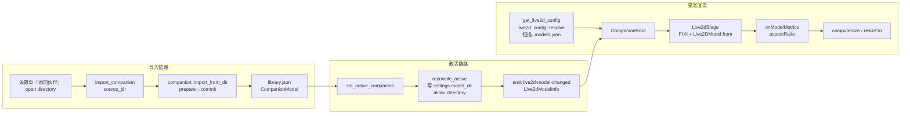

# GIF 伙伴支持技术方案(GIF_COMPANION_DESIGN)

> 状态:待评审
> 日期:2026-08-22
> 关联资产:`tmp/video_30fps_no_green.gif`(850×1000,155 帧,30fps,5.16s 循环,真透明 1-bit alpha,38MB)

---

## 1. 背景与目标

### 1.1 背景

ZapMomo 桌宠当前仅支持 Live2D(Cubism 3/4/5)模型作为伙伴展示。用户持有透明背景的
GIF 动图资产(视频转制、绿幕抠像产物),希望 GIF 也能作为伙伴导入并展示。

### 1.2 目标

- 用户可导入 `.gif` 文件作为伙伴,与 Live2D 模型共存在同一个伙伴库中;
- 桌宠窗口以 `` 原生播放(WebView 内建 GIF 解码,自动循环),复用现有全部
  窗口能力:拖拽、右键菜单、缩放、透明度、层级、锁定、托盘切换、重启恢复;
- 设置页 / Home 卡片可预览 GIF、设为使用中、重命名、移除;
- 现有 Live2D 全链路行为零回归。

### 1.3 GIF 资产画像(已实测)

| 属性 | 值 | 影响 |
|---|---|---|
| 尺寸 | 850×1000(宽高比 0.85) | `onModelMetrics` 上报 natural 尺寸即可 |
| 帧率/帧数 | 30fps × 155 帧 = 5.16s,无限循环 | `` 原生循环,无需控制 |
| 透明度 | GIF89a 1-bit alpha,四角全透明,边缘干净 | 可直接用于透明窗口 |
| 帧编码 | 局部矩形差分(~790×958/帧) | 浏览器解码器自处理,不可作为纹理集自解码 |
| 体积 | 38MB | **主要风险**,见 §6 |

## 2. 现状分析

### 2.1 数据通路现状

- **Source of Truth**:`~/.zapmomo/companions/library.json`(`CompanionModel`,字段
  `id/name/model_dir/model_file/format/imported_at`),`format` 恒为 `"cubism3"` 字符串;
- `settings.toml [live2d].model_dir` 只是 derived cache,由 `reconcile_active` 保持一致;
- 导入:`prepare`(复制到 tmp + 校验)→ `commit`(锁内 rename + 落库),入口仅接受**目录**,
  校验要求目录内存在 `.model3.json`(`src/live2d/config.rs` `find_model_file`);
- 桌宠窗口读取:`get_live2d_config` 调 `live2d::config::resolve()` **重新扫描**
  `settings.model_dir` 找 `.model3.json` → `models_present` → 前端 `Live2DModel.from()`。

### 2.2 关键 GAP(为什么现状不能直接显示 GIF)

1. `resolve()`/`find_model_file` 只认 `.model3.json`/`model.json`,GIF 伙伴 active 时
   `models_present = false`,桌宠直接不加载;
2. 导入命令 `import_companion(source_dir)` 只接受目录;
3. `sanitize_active_inner` / `set_active` 的校验 `validate_managed_model` 是
   Live2D 专属(要求 Moc + Textures),对 GIF 伙伴永远失败 → active 被错误清除;
4. 前端 `CompanionRoot` 无条件把 `model_file` 交给 `Live2dStage`(PIXI)。

### 2.3 有利条件(已具备,零改动)

| 环节 | 现状 | 说明 |
|---|---|---|
| CSP | `img-src 'self' asset: http://asset.localhost` | 本地 GIF 走 `` + asset 协议今天即合法 |
| asset scope | `allow_directory(model_dir, true)` 机制通用 | 目录内 gif 文件自动覆盖 |
| 交互层 | 拖拽/右键/滚轮全在 DOM root | 与渲染器无关 |
| 窗口尺寸 | `onModelMetrics({aspectRatio})` 驱动 `computeSize` | GIF 报 natural 尺寸即可复用 |
| 数据字段 | `CompanionModel.format: String` 且 `Live2dConfigInfo` / `Live2dModelInfo` / `CompanionView` / 前端 TS 类型**全部已透传 format** | 判别字段现成 |
| 封面探测 | `find_cover_image` 的 EXTS 含 gif | GIF 伙伴目录内唯一图片即 gif 本身,列表缩略图零成本获得动图预览 |
| UI 组件 | `ui/dropdown-menu.tsx` 已存在 | 导入双入口无需新增依赖 |

## 3. 当前架构分析



Live2D 专属耦合点(本方案要打断的):`resolve()` 扫描(渲染读取)、`validate_managed_model`
(有效性校验)、`import_from_dir`(导入)、`Live2dStage`(渲染)。
其余(锁/迁移/托盘/窗口管理/事件)均为格式无关。

## 4. 技术方案

### 决策 D1:不加新字段,以 `format == "gif"` 判别伙伴类型

**评估**:考虑过两个方案——(a)新增 `kind` 判别字段;(b)复用现有 `format: String`。
`format` 在 `CompanionModel`(Rust)→ `CompanionView` / `Live2dConfigInfo` /
`Live2dModelInfo`(命令/事件)→ 前端 TS 类型**全链路已透传**,方案 (b) 数据通路零新增、
`library.json` schema 零迁移(旧条目都是 `"cubism3"`)。(a) 引入字段冗余(format 还得保留
展示语义)。选 **(b)**,在 `companion.rs` 定义常量 `GIF_FORMAT = "gif"` 收敛魔法字符串。

### 决策 D2:`get_live2d_config` 改为「优先读伙伴库,回退旧解析」

**评估**:GIF 伙伴的 `model_dir` 内没有 `.model3.json`,`resolve()` 无法覆盖。两个选项:
(a)扩展 `find_model_file` 探测 gif(污染 Live2D 模块语义,`Live2dFormat` enum 要加变体);
(b)`get_live2d_config` 优先 `load_library_fast()` 读 active,直接取库内
`model_file/model_dir/format`(库本就是注释声明的唯一 SoT,且库内路径比 rescan 更精确),
库无 active 时回退现有 `resolve()`(保住「后台旧版迁移完成前桌宠不闪空」的窗口期语义,
见 `reconcile_active_at_startup` 注释)。选 **(b)**。

行为等价性:库有 active 时,`reconcile_active` 已保证 `settings.model_dir == active.model_dir`,
`resolve()` 找到的就是 active 的模型;改从库读对 Live2D 伙伴等价、对 GIF 伙伴正确。

### 决策 D3:导入统一入口,目录与 GIF 文件分派

`import_companion` 命令参数 `source_dir: String` → `source: String`(前后端同步改);
Rust 侧新增分派函数 `companion::import_source(path)`:目录 → 现有 `import_from_dir`;
`.gif` 文件 → 新增 `import_gif_from_file`。GIF 导入**复用** prepare→commit 原子流程:
`~/.zapmomo/companions/{id}/{原文件名}.gif`,id 仍由 `derive_id(源绝对路径)` 派生
(同文件重复导入去重,语义与目录导入一致),`name` = 文件 stem,`format = "gif"`。

前端「添加伙伴」按钮改为 DropdownMenu 双入口:「导入 Live2D 模型目录…」
(`open({directory: true})`,现状)+「导入 GIF 动图…」
(`open({filters: [{name: "GIF 动图", extensions: ["gif"]}]})`)。

### 决策 D4:校验按 format 分派

新增 `companion::validate_managed(model)`:`format == "gif"` → `validate_gif_file`
(文件存在 + 前 6 字节为 `GIF87a`/`GIF89a`);否则 → `validate_managed_model`。
`sanitize_active_inner` / `set_active` 改调分派函数。`quick_valid`(`model_file` 是文件)
本就格式无关,不动。

### 决策 D5:前端新增 `GifStage`,`CompanionRoot` 按 format 分发

`GifStage` = `` + 原生播放 + `onLoad` 上报 `naturalWidth/naturalHeight` 宽高比,
不引入 PIXI(155 帧 × 850×1000×4B ≈ 528MB 纹理内存,自解码方案已排除)。
`CompanionRoot` 维护 `{url, isGif}` 状态,`isGif` 渲染 `GifStage`,否则渲染 `Live2dStage`。
切换类型时清空 `modelRef`(Live2D 句柄),避免 dsh 动作触发已销毁模型。

### 决策 D6:GIF 伙伴不生成画布封面,复用 gif 本身做缩略图

`find_cover_image` 的「唯一根目录图片」分支会把托管目录内的 gif 本身探测为
`cover_image`,`` 缩略图天然是动图预览。设置页的画布截图封面逻辑只挂在
`SharedLive2dStage.onModelReady`,GIF 预览不渲染该组件,自动跳过。零新增代码。

### 决策 D7:GIF 专属 UI 降级

设置页选中 GIF 伙伴时:预览区用 ``;动作/表情面板不渲染(其数据源
`onModelCatalog` 只存在于 SharedLive2dStage,catalog 恒 null,现有
`showStage && catalog` 条件已隐式排除);Home 卡片当前伙伴预览走 cover 分支。
托盘/右键切换、重命名、移除、设为使用中全部通用,零改动。

## 5. 实施方案

按依赖顺序分 5 个阶段,每阶段独立可验收、可提交。测试先行(TDD):
Rust 用例进 `src/companion.rs` 的 `tests` 模块(沿用 `run_with_temp_home`),
前端用 Vitest(jsdom)。所有命令在 worktree 根执行。

### 阶段 1:Rust 伙伴库层(GIF 导入与校验)

#### Task 1.1 `GIF_FORMAT` 常量 + `validate_gif_file`

**文件**:`src/companion.rs`

先写失败测试(tests 模块内,`make_valid_model` 旁):

```rust
/// 构造最小合法 GIF(GIF89a magic + 最少头部字节)。
fn make_valid_gif(path: &Path) {
    std::fs::write(path, b"GIF89a\x01\x00\x01\x00\x00").unwrap();
}

#[test]
fn test_validate_gif_file_accepts_gif89a_and_gif87a() {
    run_with_temp_home(|home| {
        let g = home.join("a.gif");
        make_valid_gif(&g);
        assert!(validate_gif_file(&g).is_ok());
        std::fs::write(&g, b"GIF87a\x01\x00\x01\x00\x00").unwrap();
        assert!(validate_gif_file(&g).is_ok());
    });
}

#[test]
fn test_validate_gif_file_rejects_bad_magic_and_missing() {
    run_with_temp_home(|home| {
        let bad = home.join("b.gif");
        std::fs::write(&bad, b"PNG\r\n\x1a\n").unwrap();
        assert!(validate_gif_file(&bad).is_err());
        assert!(validate_gif_file(&home.join("none.gif")).is_err());
    });
}
```

运行 `cargo test --manifest-path Cargo.toml companion:: 2>&1 | tail -5`,预期编译失败
(函数未定义)。然后实现:

```rust
/// GIF 伙伴的 format 标识(与 Live2D 的 "cubism3" 同一字段空间,判别式见 is_gif)。
pub const GIF_FORMAT: &str = "gif";

/// 校验托管 GIF 伙伴:文件存在且带合法 GIF 文件头(GIF87a/GIF89a)。
/// 只读前 6 字节,不加载 38MB 级大文件的全文。
pub fn validate_gif_file(file: &Path) -> Result<(), String> {
    use std::io::Read;
    let mut f =
        std::fs::File::open(file).map_err(|e| format!("GIF 文件不存在或无法读取: {e}"))?;
    let mut magic = [0u8; 6];
    f.read_exact(&mut magic).map_err(|e| format!("读取 GIF 文件头失败: {e}"))?;
    if &magic != b"GIF87a" && &magic != b"GIF89a" {
        return Err("不是合法的 GIF 文件（缺少 GIF87a/GIF89a 文件头）".to_string());
    }
    Ok(())
}

/// format 判别:GIF 伙伴。
pub fn is_gif(model: &CompanionModel) -> bool {
    model.format == GIF_FORMAT
}
```

测试转绿后提交:`feat(companion): GIF 伙伴文件头校验`

#### Task 1.2 `import_gif_from_file`(复用 prepare→commit)

**文件**:`src/companion.rs`(新增函数,置于 `import_from_dir` 之后)

失败测试先行:

```rust
#[test]
fn test_import_gif_file_registers_and_activates() {
    run_with_temp_home(|home| {
        let src = home.join("跳舞.gif");
        make_valid_gif(&src);
        let (model, already) = import_gif_from_file(&src).unwrap();
        assert!(!already);
        assert_eq!(model.format, "gif");
        assert_eq!(model.name, "跳舞");
        assert!(model.model_file.ends_with("跳舞.gif"));
        assert!(Path::new(&model.model_file).is_file());
        assert!(model.model_file.starts_with(&model.model_dir));
        // 首次导入自动 active;源文件删除后托管副本仍有效。
        assert_eq!(load_library_fast().unwrap().active_model_id.as_deref(), Some(model.id.as_str()));
        std::fs::remove_file(&src).unwrap();
        assert!(quick_valid(&model));
    });
}

#[test]
fn test_import_gif_rejects_non_gif_extension_and_bad_content() {
    run_with_temp_home(|home| {
        let png = home.join("fake.png");
        make_valid_gif(&png); // 内容合法但扩展名不对
        assert!(import_gif_from_file(&png).unwrap_err().contains(".gif"));
        let bad = home.join("fake.gif");
        std::fs::write(&bad, b"not-a-gif").unwrap();
        assert!(import_gif_from_file(&bad).unwrap_err().contains("GIF"));
        // 失败不残留 tmp、不落库
        assert!(load_library_fast().unwrap().models.is_empty());
    });
}

#[test]
fn test_import_gif_same_file_dedups() {
    run_with_temp_home(|home| {
        let src = home.join("dup.gif");
        make_valid_gif(&src);
        let (first, _) = import_gif_from_file(&src).unwrap();
        let (second, already) = import_gif_from_file(&src).unwrap();
        assert!(already);
        assert_eq!(first.id, second.id);
        assert_eq!(load_library_fast().unwrap().models.len(), 1);
    });
}
```

实现(骨架,错误处理风格对齐 `prepare_import`):

```rust
/// 导入 GIF 动图文件:复制到托管目录 `{id}/{原文件名}` 并登记(复用 commit 原子流程)。
pub fn import_gif_from_file(source: &Path) -> Result<(CompanionModel, bool), String> {
    let source_abs = source
        .canonicalize()
        .map_err(|e| format!("无法访问源文件: {e}"))?;
    let is_gif_ext = source_abs
        .extension()
        .and_then(|s| s.to_str())
        .is_some_and(|s| s.eq_ignore_ascii_case("gif"));
    if !is_gif_ext {
        return Err("仅支持导入 .gif 文件".to_string());
    }
    for root in companion_store_roots() {
        let root_canon = root.canonicalize().unwrap_or_else(|_| root.clone());
        if source_abs.starts_with(&root_canon) {
            return Err("不能导入 ZapMomo 已托管的伙伴文件".to_string());
        }
    }
    let id = derive_id(&source_abs);
    let name = source_abs
        .file_stem()
        .map(|s| s.to_string_lossy().to_string())
        .unwrap_or_else(|| id.clone());
    { // 去重预检(短锁)
        let _g = lock();
        let lib = load_library_inner()?;
        if let Some(existing) = lib.models.iter().find(|m| m.id == id).cloned() {
            return Ok((existing, true));
        }
    }
    let store_dir = settings::get_companions_store_dir();
    let tmp_dir = store_dir.join(new_tmp_dir_name(&id));
    let final_dir = store_dir.join(&id);
    std::fs::create_dir_all(&tmp_dir).map_err(|e| format!("创建临时目录失败: {e}"))?;
    let file_name = source_abs.file_name().unwrap().to_owned();
    std::fs::copy(&source_abs, tmp_dir.join(&file_name))
        .map_err(|e| format!("复制 GIF 失败: {e}"))?;
    if let Err(e) = validate_gif_file(&tmp_dir.join(&file_name)) {
        let _ = std::fs::remove_dir_all(&tmp_dir);
        return Err(e);
    }
    commit_import(PreparedImport {
        id,
        name,
        source_path: source_abs.display().to_string(),
        tmp_dir,
        final_dir,
        model_file_rel: PathBuf::from(&file_name),
        format: GIF_FORMAT.to_string(),
        imported_at: now_rfc3339(),
    })
}

/// 统一导入入口:目录 → Live2D;`.gif` 文件 → GIF。
pub fn import_source(source: &Path) -> Result<(CompanionModel, bool), String> {
    if source.is_file() {
        import_gif_from_file(source)
    } else {
        import_from_dir(source)
    }
}
```

测试转绿后提交:`feat(companion): GIF 文件导入(复用 prepare→commit 原子流程)`

#### Task 1.3 校验分派(sanitize / set_active 支持 GIF)

**文件**:`src/companion.rs`

失败测试先行(混合库场景):

```rust
#[test]
fn test_sanitize_and_set_active_support_gif() {
    run_with_temp_home(|home| {
        let m = home.join("L"); // Live2D 伙伴
        make_valid_model(&m, "l.model3.json");
        let (l2d, _) = import_from_dir(&m).unwrap();
        let g = home.join("舞.gif"); // GIF 伙伴
        make_valid_gif(&g);
        let (gif, _) = import_gif_from_file(&g).unwrap();

        // set_active(gif) 成功(GIF 校验不再走 validate_managed_model)
        set_active(&gif.id).unwrap();
        // 删掉 Live2D 托管目录,sanitize 不应清掉 GIF active(GIF 仍有效)
        std::fs::remove_dir_all(&l2d.model_dir).unwrap();
        let lib = load_library_fast().unwrap();
        assert_eq!(lib.active_model_id.as_deref(), Some(gif.id.as_str()));

        // 篡改 GIF 魔数 → set_active 报「不可用」
        std::fs::write(Path::new(&gif.model_file), b"xxxxxx").unwrap();
        let err = set_active(&gif.id).unwrap_err();
        assert!(err.contains("不可用"), "{err}");
    });
}
```

实现:新增分派函数并替换两处调用点(`sanitize_active_inner` 的两处
`validate_managed_model`、`set_active` 的一处):

```rust
/// 按 format 分派轻量校验(GIF → 文件头;Live2D → 目录清单校验)。
fn validate_managed(model: &CompanionModel) -> Result<(), String> {
    if is_gif(model) {
        validate_gif_file(Path::new(&model.model_file))
    } else {
        live2d_cfg::validate_managed_model(Path::new(&model.model_dir))
    }
}
```

**验收**:`cargo test --manifest-path Cargo.toml companion::` 全绿
(含既有用例零回归)。

### 阶段 2:命令与配置层

#### Task 2.1 `import_companion` 接受文件路径

**文件**:`src-tauri/src/lib.rs:2958`、`src-tauri/frontend/src/lib/tauri.ts:104`、
`src-tauri/frontend/src/hooks/useCompanionLibrary.ts`

- Rust 命令签名 `source_dir: String` → `source: String`,内部改调
  `zapmomo::companion::import_source(&source)`(spawn_blocking 包装保持);
- 前端 `api.importCompanion: (args: { sourceDir: string })` → `(args: { source: string })`;
- `useCompanionLibrary.importModel(sourceDir: string)` → `importModel(source: string)`
  (内部参数名,签名语义不变,调用点 `api.importCompanion({ source })`);
- 更新 hook 的 JSDoc 注释为「导入模型目录或 GIF 文件」。

**验收**:`cargo clippy --manifest-path src-tauri/Cargo.toml -- -D warnings` 通过
(或按项目惯例的整体 clippy);前端 `pnpm -C src-tauri/frontend vitest run
useCompanionLibrary` 既有用例通过(该 hook 的测试文件已存在,参数名改动若影响桩需同步)。

#### Task 2.2 `get_live2d_config` 优先读伙伴库

**文件**:`src-tauri/src/lib.rs:2728`

改造为(决策 D2):

```rust
#[tauri::command]
fn get_live2d_config(app: AppHandle) -> Result<Live2dConfigInfo, String> {
    let settings = settings::load_settings()?;
    let live2d_settings = settings.as_ref().and_then(|s| s.live2d.clone());

    // 优先从伙伴库读 active（库是唯一 SoT；GIF 伙伴无 .model3.json，
    // resolve() 探测不到）。库无 active 时回退旧版 settings 路径解析
    // （后台旧版迁移完成前的窗口期，桌宠仍按 settings.model_dir 显示）。
    let lib = zapmomo::companion::load_library_fast()?;
    let active = zapmomo::companion::active_model(&lib)
        .filter(|m| zapmomo::companion::quick_valid(m));
    let (model_dir, model_file, format, models_present) = match active {
        Some(m) => (
            Some(m.model_dir.clone()),
            Some(m.model_file.clone()),
            Some(m.format.clone()),
            true,
        ),
        None => {
            let cfg = zapmomo::live2d::config::resolve(live2d_settings.as_ref())?;
            let present = cfg.model_file.as_ref().is_some_and(|f| f.is_file());
            (
                Some(cfg.model_dir.display().to_string()),
                cfg.model_file.map(|p| p.display().to_string()),
                cfg.format.map(|f| f.to_str().to_string()),
                present,
            )
        }
    };
    if models_present
        && let Some(dir) = &model_dir
    {
        let _ = app.asset_protocol_scope().allow_directory(dir, true);
    }
    // ……window_scale/opacity/layer/locked/drag_mode/props 段原样保留
}
```

注意:`props: detect_active_bongocat_props()` 保持(其内部 `detect_bongocat` 对
GIF 目录自然探测不到,返回 None,安全)。

**验收**:`cargo check -p zapmomo-app`(Linux webkit 依赖问题在 macOS 不适用,直接
`cargo clippy --manifest-path src-tauri/Cargo.toml -- -D warnings`)。

#### Task 2.3 事件载荷确认(零改动确认项)

`Live2dModelInfo.format` 已经是 `model.format.clone()` 字符串直传(lib.rs:2863),
GIF 伙伴切换事件自然携带 `"gif"`,前端 `onLive2dModelChanged` 收到的 payload 无需
后端改动。前端 TS 类型 `Live2dModelInfo.format: string | null` 已兼容。**本任务仅
在 TS 类型注释中补充 format 可能取 `"gif"`**(`src-tauri/frontend/src/types/tauri.ts`
的 `Live2dConfigInfo.format` / `Live2dModelInfo.format` / `CompanionModelInfo.format`
三处注释)。

### 阶段 3:前端渲染分发

#### Task 3.1 `GifStage` 组件(测试先行)

**文件**:
- Create:`src-tauri/frontend/src/components/gif/GifStage.tsx`
- Test:Create:`src-tauri/frontend/src/components/gif/GifStage.test.tsx`

失败测试先行(jsdom 不解码图片,natural 尺寸需 mock):

```tsx
import { fireEvent, render, screen } from "@testing-library/react";
import { describe, expect, it, vi } from "vitest";
import { GifStage } from "./GifStage";

describe("GifStage", () => {
  it("url 为 null 时不渲染 img", () => {
    const { container } = render(<GifStage url={null} width={400} height={480} />);
    expect(container.querySelector("img")).toBeNull();
  });

  it("加载成功后上报真实宽高比", () => {
    const onModelMetrics = vi.fn();
    render(<GifStage url="asset://localhost/x.gif" width={400} height={480}
      onModelMetrics={onModelMetrics} />);
    const img = screen.getByRole("img");
    Object.defineProperty(img, "naturalWidth", { value: 850 });
    Object.defineProperty(img, "naturalHeight", { value: 1000 });
    fireEvent.load(img);
    expect(onModelMetrics).toHaveBeenCalledWith({ aspectRatio: 0.85 });
  });

  it("加载失败上报错误", () => {
    const onError = vi.fn();
    render(<GifStage url="asset://localhost/bad.gif" width={400} height={480}
      onError={onError} />);
    fireEvent.error(screen.getByRole("img"));
    expect(onError).toHaveBeenCalled();
  });
});
```

实现:

```tsx
import type { CSSProperties } from "react";

interface GifStageProps {
  /** GIF 文件的 asset:// URL,null 时不渲染。 */
  url: string | null;
  width: number;
  height: number;
  className?: string;
  style?: CSSProperties;
  onError?: (error: Error) => void;
  /** 加载完成、可读取真实宽高时回调(供上层自适应窗口尺寸,语义对齐 Live2dStage)。 */
  onModelMetrics?: (metrics: { aspectRatio: number }) => void;
}

/**
 * GIF 伙伴渲染组件:原生  播放(WebView 内建 GIF 解码,自动循环),
 * 不引入 PIXI(大 GIF 逐帧解码为纹理内存不可行,见 GIF_COMPANION_DESIGN §4 D5)。
 * 交互(拖拽/右键/滚轮)由 CompanionRoot 的 DOM 层承担,这里 pointer-events-none。
 */
export function GifStage({ url, width, height, className, style, onError, onModelMetrics }: GifStageProps) {
  return (
    <div
      className={className}
      style={{ width, height, ...style }}
      data-testid="gif-stage"
    >
      {url && (
         {
            const img = e.currentTarget;
            if (img.naturalWidth > 0 && img.naturalHeight > 0) {
              onModelMetrics?.({ aspectRatio: img.naturalWidth / img.naturalHeight });
            }
          }}
          onError={() => onError?.(new Error(`GIF 加载失败: ${url}`))}
        />
      )}
    </div>
  );
}
```

**验收**:`pnpm -C src-tauri/frontend vitest run GifStage` 绿后提交
`feat(companion): GifStage 组件(img 原生播放 + 宽高比上报)`。

#### Task 3.2 `CompanionRoot` 分发(测试先行)

**文件**:
- Modify:`src-tauri/frontend/src/components/CompanionRoot.tsx`
- Test:Modify:`src-tauri/frontend/src/components/CompanionRoot.test.tsx`(既有桩
  `get_live2d_config` mock 处,补一条 format="gif" 用例)

改造点:

```tsx
// state:modelUrl 改为 stage 描述
const [stage, setStage] = useState<{ url: string | null; isGif: boolean }>({
  url: null,
  isGif: false,
});

// config effect(原 154-159 行):
useEffect(() => {
  if (config?.models_present && config.model_file) {
    setStage({ url: toAssetUrl(config.model_file), isGif: config.format === "gif" });
  }
  setProps(config?.props ?? null);
}, [config]);

// 事件 effect(原 174-183 行):
const unlisten = onLive2dModelChanged((info) => {
  setStage(
    info.model_file && info.format
      ? { url: toAssetUrl(info.model_file), isGif: info.format === "gif" }
      : { url: null, isGif: false },
  );
  setProps(info.props ?? null);
});

// 渲染分支(原 340-350 行),并处理 Live2D 句柄残留:
{stage.isGif ? (
  <GifStage
    url={stage.url}
    width={size.width}
    height={size.height - BUBBLE_STRIP}
    onModelMetrics={handleModelMetrics}
  />
) : (
  <Live2dStage
    ref={stageRef}
    modelUrl={stage.url}
    /* 其余 props 原样 */
    onModelLoaded={(m) => { modelRef.current = m; }}
  />
)}
```

`modelRef` 残留防御:分发渲染中 Live2dStage 卸载不会触发 `onModelLoaded(null)`,
在 stage effect 中处理:

```tsx
useEffect(() => {
  if (stage.isGif) modelRef.current = null; // dsh 动作对 GIF 无效,清空防悬空句柄
}, [stage.isGif]);
```

新增测试用例(参照既有文件桩结构):

```tsx
it("format=gif 时渲染 GifStage 而非 Live2dStage", async () => {
  // mock get_live2d_config 返回 { model_file: "/x.gif", format: "gif",
  //   models_present: true, ... }
  // 断言:出现 data-testid="gif-stage";无 canvas(PIXI 未初始化)
});
```

**验收**:`pnpm -C src-tauri/frontend vitest run CompanionRoot` 全绿(含既有用例)。

### 阶段 4:设置页与 Home 卡适配

#### Task 4.1 导入双入口 + GIF 预览分支

**文件**:`src-tauri/frontend/src/pages/CompanionPage.tsx`

1. 「添加伙伴」Button(`:495`)改为 `DropdownMenu`(用现有
   `@/components/ui/dropdown-menu`):

```tsx
<DropdownMenu>
  <DropdownMenuTrigger asChild>
    <Button size="sm" disabled={loading}>
      <Upload className="h-4 w-4" />
      添加伙伴
    </Button>
  </DropdownMenuTrigger>
  <DropdownMenuContent align="end">
    <DropdownMenuItem onClick={handleImportDir}>
      <FolderOpen className="h-4 w-4" /> 导入 Live2D 模型目录…
    </DropdownMenuItem>
    <DropdownMenuItem onClick={handleImportGif}>
      <ImageIcon className="h-4 w-4" /> 导入 GIF 动图…
    </DropdownMenuItem>
  </DropdownMenuContent>
</DropdownMenu>
```

2. 原 `handleImport` 拆两个(文件选择器:

```tsx
const handleImportDir = useCallback(async () => {
  const dir = await open({ directory: true, title: "选择 Live2D 模型目录" });
  if (typeof dir !== "string") return;
  setStageError(null);
  const model = await importModel(dir);
  if (model) setSelectedId(model.id);
}, [importModel]);

const handleImportGif = useCallback(async () => {
  const file = await open({
    title: "选择 GIF 动图",
    filters: [{ name: "GIF 动图", extensions: ["gif"] }],
  });
  if (typeof file !== "string") return;
  setStageError(null);
  const model = await importModel(file);
  if (model) setSelectedId(model.id);
}, [importModel]);
```

3. 预览分支(`showStage` 定义 `:475` 与渲染 `:663`):

```tsx
const isGif = selected?.format === "gif";
const showStage = !!selected?.valid && !isGif
  && previewSize.width > 0 && previewSize.height > 0;
// 预览区内,showStage 的 SharedLive2dStage 之后并列:
{selected?.valid && isGif && (
  
)}
```

动作/表情面板(`showStage && catalog` 条件)与封面生成(`handleModelReady` 挂在
SharedLive2dStage)无需改动——GIF 选中时 `showStage=false`、catalog 恒 null,自动跳过。
「设为当前使用」按钮对 valid GIF 可用(零改动)。

#### Task 4.2 Home 卡片 GIF 分支

**文件**:`src-tauri/frontend/src/components/home/CurrentCompanionCard.tsx:105-149`

预览分支链最前插入 GIF 短路(在 `stageReady` 判定之前):

```tsx
const isGif = companion?.format === "gif";
// stageReady 计算保持;渲染分支:
if (isGif && companion?.valid) {
  preview = (
    
  );
} else if (companion == null) { /* 原分支链不变 */ }
```

**验收(阶段 4 整体)**:`pnpm -C src-tauri/frontend vitest run` 全绿;
`pnpm -C src-tauri/frontend exec tsc -b` 通过(注意:必须 `tsc -b`,
根目录 `tsc --noEmit` 有空通过的坑)。

### 阶段 5:全量验收

#### Task 5.1 静态检查与测试

```bash
cargo fmt --check
cargo clippy --manifest-path Cargo.toml -- -D warnings
cargo clippy --manifest-path src-tauri/Cargo.toml -- -D warnings
cargo test --manifest-path Cargo.toml
pnpm -C src-tauri/frontend vitest run
pnpm -C src-tauri/frontend exec tsc -b
```

(worktree 环境:若 node_modules 缺失先 `pnpm -C src-tauri/frontend install --prefer-offline`;
磁盘紧张时 cargo 加 `CARGO_TARGET_DIR` 指向共享 target。)

#### Task 5.2 手动端到端清单(`pnpm tauri dev`)

1. 设置页 → 添加伙伴 → 「导入 GIF 动图…」→ 选 `tmp/video_30fps_no_green.gif`;
2. 列表出现新条目,缩略图为动图(gif 本身即 cover);
3. 设为当前使用 → 桌宠窗口切换为 GIF 循环播放,透明背景无白块;
4. 窗口尺寸按 0.85 宽高比自适应;拖拽 / 右键菜单 / ⌘+滚轮缩放 / 透明度 /
   层级置底点穿 / 锁定 / 修饰键拖动 全部生效;
5. GIF ↔ Live2D 伙伴来回切换(设置页与托盘菜单各一次),无残留、无白屏;
6. 移除 GIF 伙伴(先切走 active)→ 托管目录删除;active 落位正确;
7. 重启应用 → GIF 伙伴恢复显示;
8. 观察 Activity Monitor:记录 GIF 播放时的 CPU 占用(见 §6 风险)。

**回归**:导入 Live2D 模型目录、动作/表情预览、BongoCat 伙伴表演各验一遍。

## 6. 风险与边界

| 风险 | 评估 | 缓解 |
|---|---|---|
| 38MB GIF 首载延迟 | asset 协议全量读取 + 解码,首次显示或有秒级延迟 | 首版接受;加载中无占位(空窗)可观察后决定是否加 skeleton |
| 30fps@850×1000 解码 CPU | WKWebView 内建解码,CPU 占用需实测(T5.2 步骤 8) | 若超标:后续导入时可选降帧/缩尺寸(§7) |
| 1-bit alpha 边缘 | 实测边缘干净;高分屏下或有轻微锯齿 | 首版接受 |
| GIF 无动作/表情/口型 | 产品能力降级,UI 已按 D7 隐藏 | 非缺陷;文档明示 |
| 超大 GIF(>100MB) | `` 仍可播但内存/CPU 代价高 | 首版不设上限;可在导入时 warn(后续) |
| 动图封面 | cover_image = gif 本身,列表页多个大 GIF 同时动可能耗电 | 首版接受;后续可列表静止首帧 |
| Windows/Linux | 全链路无平台分支改动;`http://asset.localhost` 走同一 img 标签 | release.yml 三个平台构建覆盖;本方案不引入 cfg 分支 |

## 7. 非目标(后续优化方向)

1. **导入时转码透明 WebM/HEVC**(项目已有 VP9/HEVC alpha 工具链):
   38MB GIF 可缩至 1-5MB 且硬解,CPU 显著下降——作为导入管线可选优化,不阻塞本方案;
2. 导入时 GIF 降帧/缩尺寸预处理;
3. 多 GIF 状态切换(如 idle/高兴 两段动图按事件切换);
4. GIF 帧级控制(暂停/变速)。

## 8. 涉及文件总览

| 层 | 文件 | 动作 |
|---|---|---|
| Rust 库 | `src/companion.rs` | 常量/校验/导入/分派 + 测试 |
| Rust 命令 | `src-tauri/src/lib.rs` | `import_companion` 参数、`get_live2d_config` 读库 |
| 前端 lib | `src-tauri/frontend/src/lib/tauri.ts` | `importCompanion` 参数名 |
| 前端类型 | `src-tauri/frontend/src/types/tauri.ts` | format 注释补充 |
| 前端 hook | `src-tauri/frontend/src/hooks/useCompanionLibrary.ts` | `importModel` 语义扩展 |
| 前端组件 | `src-tauri/frontend/src/components/gif/GifStage.tsx`(+test) | 新建 |
| 前端组件 | `src-tauri/frontend/src/components/CompanionRoot.tsx`(+test) | 分发 |
| 前端页面 | `src-tauri/frontend/src/pages/CompanionPage.tsx` | 双入口 + GIF 预览 |
| 前端组件 | `src-tauri/frontend/src/components/home/CurrentCompanionCard.tsx` | GIF 分支 |
