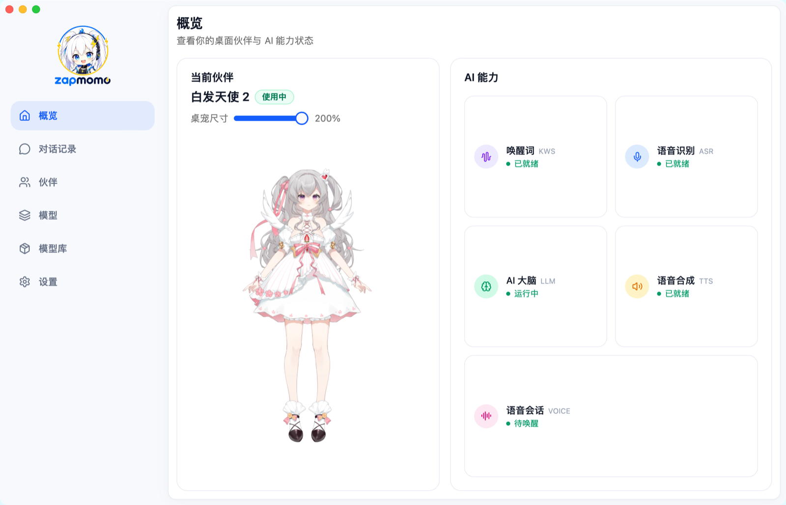

<div align="center">

**简体中文** | [English](README.en.md)

</div>

<div align="center">
  

  <p>
    <a href="https://github.com/shenjingnan/zapmomo/releases"></a>
    <a href="https://crates.io/crates/zapmomo"></a>
    <a href="https://crates.io/crates/zapmomo"></a>
    <a href="https://github.com/shenjingnan/zapmomo/actions/workflows/ci.yml"></a>
    <a href="https://codecov.io/gh/shenjingnan/zapmomo"></a>
    <br />
    <a href="LICENSE"></a>
    <a href="https://www.rust-lang.org/"></a>
    <a href="#下载桌面应用"></a>
    <a href="#下载桌面应用"></a>
    <a href="#下载桌面应用"></a>
  </p>
</div>

An open-source, real-time desktop **AI companion** with voice, memory, and a customizable virtual character.

开源的实时桌面 AI 伴侣：语音交互、记忆能力、可定制的虚拟角色。

> 📚 中文文档：[文档站](docs/)，含快速开始、KWS / ASR / TTS / LLM、配置、桌面应用与贡献指南。

<div align="center">
  
  <p><em>桌面应用「概览」页：展示当前伙伴与 AI 能力状态</em></p>
</div>

## 特性

- **语音唤醒（KWS）** — 基于 sherpa-onnx 的 zipformer 唤醒词检测，支持实时麦克风监听与离线 wav 检测；自定义关键词直接输中文，自动转拼音 token
- **语音识别（ASR）** — 基于 sherpa-onnx 的流式 zipformer 识别（中英双语），实时转文字幕，自动加标点、支持热词
- **文本转语音（TTS）** — 基于 sherpa-onnx 的 ZipVoice 零样本声音克隆（中英双语），内置音色与自定义参考音频
- **本地大语言模型（LLM）** — 集成 llama.cpp 本地推理（任意 GGUF，流式对话 + Agent 工具调用），或接入 OpenAI 兼容远程 API
- **语音会话（Voice）** — 一句话唤醒 → 语音识别 → LLM 句级流式回复 → TTS 实时播报，支持唤醒词打断与免唤醒续聊
- **Live2D 虚拟角色** — 桌面应用常驻角色窗口（Cubism 2/3/4/5），位置记忆与百分比缩放，拖动不抢焦点
- **桌面应用** — 基于 Tauri 2 的 GUI（概览 / 对话 / 伙伴 / 模型 / 设置多页面控制面板 + 常驻角色窗口），Windows / macOS / Linux 三平台安装包
- **CLI** — `kws` / `asr` / `tts` / `llm` / `voice` 子命令覆盖全部能力，支持 bash / zsh / fish / powershell / elvish 自动补全

## 下载桌面应用

点击下方按钮直接下载对应系统的最新版安装包（无需登录 GitHub，自动指向最新 Release）：

| 系统 | 芯片 / 架构 | 立即下载 |
| --- | --- | --- |
| Windows 10 / 11 | x64 | [](https://github.com/shenjingnan/zapmomo/releases/latest/download/ZapMomo_Windows_x64.exe) |
| macOS 13+ | Apple Silicon（M1/M2/M3/M4） | [](https://github.com/shenjingnan/zapmomo/releases/latest/download/ZapMomo_macOS_arm64.dmg) |
| macOS 13+ | Intel | [](https://github.com/shenjingnan/zapmomo/releases/latest/download/ZapMomo_macOS_x64.dmg) |
| Ubuntu / Debian | amd64 | [](https://github.com/shenjingnan/zapmomo/releases/latest/download/ZapMomo_Linux_amd64.deb) |
| Fedora / RHEL | x86_64 | [](https://github.com/shenjingnan/zapmomo/releases/latest/download/ZapMomo_Linux_x86_64.rpm) |

- Windows 企业批量部署可选 [MSI 版](https://github.com/shenjingnan/zapmomo/releases/latest/download/ZapMomo_Windows_x64.msi)；Linux 可选 [AppImage](https://github.com/shenjingnan/zapmomo/releases/latest/download/ZapMomo_Linux_amd64.AppImage) 免安装直接运行。
- 完整版本与更新日志见 [Releases](https://github.com/shenjingnan/zapmomo/releases)。
- 🍎 Mac 不确定芯片？左上角  →「关于本机」：显示「芯片：Apple M…」选 arm64，显示「处理器：Intel…」选 x64。
- KWS / ASR / TTS 模型资产不随安装包分发，首次使用请在应用「模型」页或用 CLI `install-model` 下载。

### macOS 首次打开（未签名）

项目未申请 Apple Developer 证书，安装包**未签名**。每次从 Releases 下载后，首次启动都会被系统拦截（提示「无法验证开发者」）。请先将 App 拖入「应用程序」，再执行：

```bash
xattr -cr "/Applications/Zap Momo.app"
```

随后启动即可正常打开。若 App 不在「应用程序」，把命令里的路径换成实际位置；或右键 App →「打开」→ 再次点击「打开」。

## 关键词唤醒词（KWS）

接入 sherpa-onnx 关键词检测模型（zipformer 中英混合），实现「说出唤醒词 → 程序反应」。

### 快速开始

```bash
# 1. 下载模型（约 31MB，默认安装到 ~/.zapmomo/models/<模型名>，不入库）
cargo run -- kws install-model

# 2. 离线验证（无需麦克风）：对模型自带 wav 检测出「文森特卡索」「法国」
cargo run -- kws test

# 3. 实时监听：说出唤醒词，控制台打印反应（首次运行需授权麦克风）
cargo run -- kws run

# 4. 查看可用麦克风设备
cargo run -- kws devices
```

### 模型来源与校验

模型**不随代码分发**，由 CLI 内置的 `kws install-model` 命令（或 `scripts/download-kws-model.sh`）按 `models/manifest.json` 清单下载：

- **清单** `models/manifest.json`（随仓库）记录每个模型的 `name / version / source / sha256 / license`
- **校验**：下载后对整包计算 sha256 与清单比对，**不匹配即删除报错**；解压先到临时目录再原子移动，避免留下损坏的半截模型
- **幂等**：模型已存在且完整则跳过
- **合规**：第三方来源与许可见 `models/THIRD_PARTY_NOTICES.md`
- ASR 与 TTS 已沿用同一套清单机制（见下文「语音识别」「文本转语音」）

### 命令说明

| 命令 | 说明 |
|------|------|
| `kws run` | 实时监听麦克风，检测唤醒词。`--duration 秒` 限时、`--device 名称` 指定设备、`--keywords` 附加关键词（直接输中文，多个用 `/` 分隔） |
| `kws test` | 离线检测 wav（默认模型自带 `test_wavs/zh_3.wav`）。`--wav` 指定文件 |
| `kws devices` | 列出可用输入设备 |
| `kws install-model` | 下载并安装唤醒词模型（默认 `~/.zapmomo/models/<模型名>`）。`--model-dir` 指定目录、`--force` 强制重装 |

### 配置

可在 `~/.zapmomo/settings.toml` 中添加 `[kws]` 段覆盖默认值（全部可选）：

```toml
[kws]
model_dir = "/path/to/model"              # 模型目录（支持 ${env.VAR}）
provider = "cpu"                           # 推理后端，默认 cpu
num_threads = 4                            # 推理线程数，默认 2
chunk_size = 3200                          # 每次喂给模型的采样数（@16k），默认 3200
sample_rate = 16000                        # 模型输入采样率，默认 16000
keywords_score = 1.0                       # 关键词 boosting 分数
keywords_threshold = 0.25                  # 触发阈值：越大越不容易误触发（0.15~0.5）
encoder = "encoder-...-chunk-16-left-64.int8.onnx"   # 模型目录内带 int8 变体可选
decoder = "decoder-...-chunk-16-left-64.onnx"
joiner  = "joiner-...-chunk-16-left-64.onnx"
tokens  = "tokens.txt"
keywords_file = "/path/to/keywords.txt"    # 自定义关键词文件
debug = false
```

### 自定义唤醒词

**直接输入中文即可**：`--keywords 你好小智` 会由内置的拼音转换（`src/kws/token.rs`）自动把汉字拆成模型
可编码的 ppinyin token（`你好小智` → `n ǐ h ǎo x iǎo zh ì`），无需任何外部工具；多个关键词用 `/` 或换行分隔。

keywords 文件（默认 `<model_dir>/test_wavs/keywords.txt`，可用 `[kws] keywords_file` 覆盖）每行一个关键词，
同样支持直接写中文，也支持精确的「token + `@显示词`」格式：

```
你好小智 @你好小智                      # 中文：直接写，自动转 ppinyin
w én s ēn t è k ǎ s uǒ @文森特卡索     # 中文：精确 token（声母+带调韵母）
L AY1 T AH1 P @LIGHT_UP                  # 英文：ARPAbet 音素
```

v1 默认使用模型自带的中英混合关键词集（见 `test_wavs/keywords.txt`）。

## 语音识别（ASR）

接入 sherpa-onnx 流式语音识别模型（zipformer 中英双语），把麦克风语音实时转成文本（支持中英混说）。

### 快速开始

```bash
# 1. 下载模型（约 790MB：ASR int8 + 标点，默认安装到 ~/.zapmomo/models/<模型名>，不入库）
cargo run -- asr install-model

# 2. 离线转写（无需麦克风）：对模型自带 wav 输出转写文本（最终结果自动加标点）
cargo run -- asr test

# 3. 实时转写：说话即出字幕（首次运行需授权麦克风，Ctrl-C 退出）
cargo run -- asr run

# 4. 查看可用麦克风设备
cargo run -- asr devices
```

模型来源、sha256 校验、幂等安装与 `[kws]` 完全一致（见上文「模型来源与校验」）。

### 标点与热词

- **标点恢复（自动开启）**：`install-model` 会同时下载标点模型，识别出的**最终结果自动加标点**（如「昨天是 Monday，是星期三。」）。标点模型缺失时 ASR 仍可用，仅无标点（降级不报错）。
- **热词增强**：对专有名词/易错词提权。命令行用 `--hotwords "尼日尔河 文森特卡索"`（空格分隔、中文直接写），或写入 `settings.toml` 的 `[asr] hotwords`。

### 命令说明

| 命令 | 说明 |
|------|------|
| `asr run` | 实时监听麦克风并转写。`--duration 秒` 限时、`--device 名称` 指定设备、`--hotwords "词1 词2"` 热词 |
| `asr test` | 离线转写 wav（默认模型自带 `test_wavs/0.wav`）。`--wav` 指定文件、`--hotwords` 热词 |
| `asr devices` | 列出可用输入设备 |
| `asr install-model` | 下载并安装 ASR + 标点模型（默认 `~/.zapmomo/models/<模型名>`）。`--model-dir` 指定目录、`--force` 强制重装 |

### 配置

可在 `~/.zapmomo/settings.toml` 中添加 `[asr]` 段覆盖默认值（全部可选）：

```toml
[asr]
model_dir = "/path/to/model"              # 模型目录（支持 ${env.VAR}）
provider = "cpu"                           # 推理后端，默认 cpu
num_threads = 4                            # 推理线程数，默认 2
decoding_method = "greedy_search"          # greedy_search | modified_beam_search
enable_endpoint = true                     # 端点检测（静音自动断句）
rule1_min_trailing_silence = 2.4          # 断句静音阈值（秒）
rule2_min_trailing_silence = 1.2
rule3_min_utterance_length = 20.0
hotwords = "你好小智 文森特卡索"          # 热词（空格分隔、中文直接写），可选
enable_punctuation = true                  # 最终结果自动加标点，默认 true
punctuation_model = "model.onnx"           # 标点模型文件名（相对标点模型目录）
encoder = "encoder-epoch-99-avg-1.int8.onnx"
decoder = "decoder-epoch-99-avg-1.onnx"    # 官方 int8 配方：fp32 decoder
joiner  = "joiner-epoch-99-avg-1.int8.onnx"
tokens  = "tokens.txt"
debug = false
```

## 文本转语音（TTS）

接入 sherpa-onnx 的 ZipVoice 零样本声音克隆模型（中英双语），把文本合成为 wav（离线批量合成，无流式 feed）。

### 快速开始

```bash
# 1. 下载模型（约 156MB：TTS 主包 + 声码器，默认安装到 ~/.zapmomo/models/<模型名>，不入库）
cargo run -- tts install-model

# 2. 列出内置音色（雷军、新闻女声等）
cargo run -- tts voices

# 3. 合成语音（默认音色雷军；--voice 切换内置音色、--speed 调语速）
cargo run -- tts run --text "你好，我是 ZapMomo"
cargo run -- tts run --text "你好" --voice news-female --speed 1.2
```

- **零样本声音克隆**：`--voice 内置音色` 一键使用，或用 `--reference-wav 参考音频` + `--reference-text 转写文本` 克隆任意音色
- **输出**：默认 `~/.zapmomo/tts/<时间戳>.wav`，`--output` 指定路径
- 模型来源、sha256 校验、幂等安装与 KWS/ASR 一致（见上文「模型来源与校验」）

### 命令说明

| 命令 | 说明 |
|------|------|
| `tts run` | 合成文本为 wav。`--text` 必填；`--voice` 内置音色、`--speed` 语速、`--reference-wav/--reference-text` 自定义参考音色、`--output` 输出路径 |
| `tts voices` | 列出内置音色（解析模型包 `test_wavs/prompt.txt`） |
| `tts install-model` | 下载安装 TTS 主包 + 声码器（默认 `~/.zapmomo/models/<模型名>`）。`--model-dir` 指定目录、`--force` 强制重装 |

### 配置

可在 `~/.zapmomo/settings.toml` 中添加 `[tts]` 段覆盖默认值（全部可选）：

```toml
[tts]
model_dir = "/path/to/model"              # 模型目录（支持 ${env.VAR}）
encoder = "encoder.int8.onnx"
decoder = "decoder.int8.onnx"
vocoder = "vocos_24khz.onnx"              # 声码器（install-model 时一并下载）
tokens = "tokens.txt"
lexicon = "lexicon.txt"
data_dir = "espeak-ng-data"
reference_wav = "test_wavs/leijun-1.wav"  # 默认音色参考音频
reference_text = "那还是36年前, 1987年. 我呢考上了武汉大学的计算机系."  # 参考音频转写
num_steps = 4                             # 扩散解码步数（质量/速度权衡）
speed = 1.0                               # 语速
provider = "cpu"                          # 推理后端，默认 cpu
num_threads = 2                           # 推理线程数
debug = false
```

## 本地大语言模型（LLM）

基于 llama.cpp（Rust 绑定 `llama-cpp-2`）的本地大语言模型，支持流式对话与 Agent 工具调用；也可通过 OpenAI 兼容的 `/v1/responses` 接口接入远程 API 或 `llama-server`。

LLM 模型为 **GGUF 文件**：内置清单提供多个可一键下载的预设（应用内「AI 大脑（LLM）配置」页 / 模型库），也支持自备 GGUF 放入 `~/.zapmomo/models/<任意目录>/` 自动发现，或用 `[llm] model_path` 指定路径。

### 快速开始

```bash
# 1. 获取模型：桌面应用「AI 大脑（LLM）配置」页一键下载（Qwen3-0.6B / 4B 预设），
#    或自行下载推荐模型 Qwen3-4B-Instruct-2507（Q4_K_M 量化约 2.5GB）放到 ~/.zapmomo/models/
# 2. 验证模型可加载
cargo run -- llm load

# 3. 单轮对话（流式输出）
cargo run -- llm chat --text "你好，你是谁？"
```

- **推荐模型**：Qwen3-4B-Instruct-2507（`Qwen3-4B-Instruct-2507-Q4_K_M.gguf`）；任意 GGUF 均可，自动发现
- **后端**：默认纯 CPU；Metal 加速已预留（`gpu_layers` 可配，llama-cpp-2 0.1.154 的 Metal logits 崩溃待升级依赖后启用）
- **Agent**：循环调用 provider、执行工具调用，直到产出纯文本回复（最多 10 轮，防止死循环）
- **远程接入**：配置 `base_url / api_key / model` 走 OpenAI 兼容 `/v1/responses`（官方 API 或 `llama-server`）

### 命令说明

| 命令 | 说明 |
|------|------|
| `llm load` | 加载模型并打印信息（架构 / 上下文）。`--model-path` 指定 GGUF |
| `llm chat` | 单轮对话（加载 + 流式生成）。`--text` 必填、`--model-path` 指定 GGUF |

### 配置

可在 `~/.zapmomo/settings.toml` 中添加 `[llm]` 段覆盖默认值（全部可选）：

```toml
[llm]
enabled = false                    # 是否启用（桌面应用默认懒加载）
provider = "local"                 # local（llama.cpp）| http（OpenAI 兼容）
model_path = "/path/to/model.gguf" # GGUF 绝对路径（支持 ${env.VAR}）
system_prompt = "你是 ZapMomo，一个友好的桌面 AI 伙伴。请用简洁自然的中文回答，语气亲切，不要啰嗦。"
context_size = 8192                # 上下文窗口（token）
batch_size = 512                   # 单次 decode 的 batch 大小
max_tokens = 512                   # 最多生成 token 数
temperature = 0.7
top_p = 0.8
top_k = 20
min_p = 0.05
repeat_penalty = 1.05
seed = 0                           # 随机种子；0 = 随机
threads = 0                        # CPU 线程数；0 = 自动（物理核数 - 2）
gpu_layers = 0                     # 卸载到 GPU 的层数；-1 = 全部（Metal），0 = 纯 CPU
enable_thinking = false            # Qwen3 思考模式（输出 <think> 块）
auto_load = false                  # 应用启动时自动加载模型
# --- http provider 专用 ---
# base_url = "http://127.0.0.1:8080/v1"  # OpenAI 兼容 base URL
# api_key = ""                            # API key（本地 server 可留空）
# model = "qwen3-4b"                      # 模型名
```

## 语音会话（Voice）

把 KWS / ASR / LLM / TTS 四个能力模块串成一条完整对话链路：**唤醒词 → 识别 → 思考 → 句级流式播报**。
sherpa-onnx 的 TTS 只有整句一次性合成，因此「流式输出」由句级流水线近似：LLM 流式 token → 断句 → 独立合成线程逐句合成 → 边合成边播放。

- **唤醒词打断** — 播报/思考期间保持唤醒词监听，再次唤醒立即打断回听
- **免唤醒续聊** — 回复播完后自动进入聆听，无需重复唤醒

### 快速开始

```bash
# 开始语音会话：说唤醒词唤醒、对话播报，Ctrl-C 退出
cargo run -- voice run
```

### 命令说明

| 命令 | 说明 |
|------|------|
| `voice run` | 跑完整语音会话（唤醒 → 识别 → 对话 → 句级流式播报）。`--keywords` 唤醒词、`--voice` 音色、`--speed` 语速、`--max-turns` 轮数上限 |

### 配置

可在 `~/.zapmomo/settings.toml` 中添加 `[voice]` 段覆盖默认值（全部可选）：

```toml
[voice]
enabled = true                # 应用启动时自动进入待唤醒，默认 true
keywords = "你好小智"          # 会话唤醒词（中文直接写，多个用 / 分隔），默认 KWS 模型内置
voice = "leijun-1"             # 回复用 TTS 音色 id
speed = 1.0                    # 播报语速
max_turns = 0                  # 最多对话轮数；0 = 无限（Ctrl-C 退出）
history_max = 12               # 传给 LLM 的历史消息条数上限
barge_in = true                # 播报/思考中唤醒词打断，默认 true
follow_up = true               # 回复播完自动聆听（免唤醒续聊），默认 true
welcome_text = "你好，我在。"  # 唤醒后的欢迎语
```

## 桌面应用（Tauri 2）

复用同一套 KWS / ASR / TTS / LLM / Voice / 音频 / 配置逻辑的桌面 GUI，由「控制面板」+「常驻角色窗口」组成：

- **控制面板** — 多页面 GUI：**概览**（当前伙伴与 AI 能力状态）、**对话**（LLM 聊天，对话记录持久化）、**伙伴**（导入与切换 Live2D 伙伴）、**模型**（KWS / ASR / LLM / TTS 监听、合成、对话与模型下载）、**设置**（麦克风设备、TTS 音色等）
- **常驻角色窗口** — Live2D 虚拟角色独立悬浮，见下文「Live2D 虚拟角色」
- **语音会话** — 唤醒 → 对话 → 语音回复全链路，见上文「语音会话」

桌面端代码在 `src-tauri/`（前端为 React + Vite + TypeScript）。开发模式与构建安装包（`pnpm tauri dev` / `pnpm tauri build`）见[贡献指南](docs/content/docs/contributing/index.mdx)。

> 打包版内置「下载模型」按钮：首次使用时若缺模型，在「配置」面板点击即可自动
> 下载到 `~/.zapmomo/models/<模型名>`（KWS / ASR / TTS 均可，也可用
> `zapmomo kws|asr|tts install-model`）。macOS 未签名安装包的打开方式见上文「macOS 首次打开」。

### 一键重启

设置面板「通用」、角色右键菜单与托盘菜单均提供「重启」：退出后自动重新拉起，用于应用需要重启才能生效的配置。

- **打包版（生产）** — 正常：前端资源内置（`asset://`），重启后直接加载。
- **开发模式（`pnpm tauri dev`）** — 重启后新进程会**白屏**（Tauri 已知问题 [tauri#6163](https://github.com/tauri-apps/tauri/issues/6163)），需要重启效果时请手动重跑 `pnpm tauri dev`，详见[贡献指南](docs/content/docs/contributing/index.mdx)。

### Live2D 虚拟角色

常驻角色窗口：显示 Live2D 角色（呼吸 / 眨眼等自动动画），与设置面板分离、独立悬浮。

- **常驻与隐形** — 按住左键拖动移动（不抢焦点、不干扰其他应用）；macOS 上从 Dock / Cmd+Tab 隐形，原生右键菜单可隐藏角色 / 缩放
- **位置记忆 + 百分比缩放** — 关闭后自动记住位置，缩放范围 25% ~ 200%（设置面板、`cmd/ctrl + 滚轮`、右键菜单均可调节）
- **尺寸自适应** — 窗口尺寸随模型真实包围盒宽高比自适应
- **格式** — 支持 Cubism 2 / 3 / 4 / 5（`.model3.json` / `model.json`）
- **模型来源** — 用户自备 Live2D 模型目录（非清单下载），默认 `~/.zapmomo/models/live2d`；Cubism Core 运行时随仓库版本管理

可在 `~/.zapmomo/settings.toml` 中添加 `[live2d]` 段覆盖默认值（全部可选）：

```toml
[live2d]
model_dir = "/path/to/live2d-model"      # 模型根目录（含 .model3.json / model.json）
window_position = { x = 100, y = 100 }   # 角色窗口位置记忆
window_scale = 1.0                       # 窗口缩放（0.25 ~ 2.0）
```

## 参与贡献

欢迎为 ZapMomo 贡献代码！以下内容面向贡献者，已整理到文档站：

- [参与贡献](docs/content/docs/contributing/index.mdx) — 开发环境搭建、常用命令、测试与 Git 工作流
- [项目结构](docs/content/docs/development/project-structure.mdx) — 仓库目录树与各模块职责
- [依赖说明](docs/content/docs/development/dependencies.mdx) — 各 crate 依赖的用途
- [发布流程](docs/content/docs/contributing/release.mdx) — release-plz + tauri-action 三平台自动构建

## 许可

[GPL-3.0](LICENSE)
