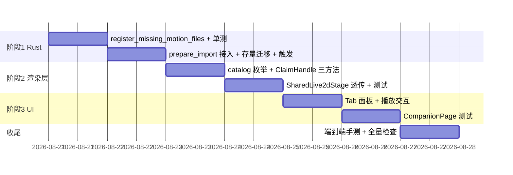

# 技术方案：伙伴页 Live2D 动作/表情展示与预览

> 日期：2026-08-20
> 基线：main @ e1cc154d
> 状态：待评审

## 1. 背景与现状分析

### 1.1 需求

伙伴页（`/companion`）当前只能「导入并管理」Live2D 伙伴，预览为静态展示。本方案为其增加**动作（Motion）与表情（Expression）的枚举展示与点击预览**，让用户在设置窗口即可查看「这个伙伴能做哪些动作」。

### 1.2 现状事实（已逐项核实）

| 层 | 现状 | 证据 |
| --- | --- | --- |
| UI | 伙伴页无任何动作/表情展示与播放入口；全局 grep `motion\|expression` 前端零命中 | `src-tauri/frontend/src/pages/CompanionPage.tsx` |
| 渲染 | 两处加载均显式 `{ autoInteract: false }`，刻意关闭「点击触发动作 + 眼神跟随」，定位静态展示 | `Live2dStage.tsx:122`、`previewManager.ts:174` |
| 库能力 | pixi-live2d-display 0.4.0 完整支持枚举与播放：`motionManager.definitions`（按组）、`startMotion(group, index, priority)`、`expressionManager.definitions` + `setExpression(indexOrName)` + `resetExpression()` | `node_modules/pixi-live2d-display/types/index.d.ts:652-802, 932-1050` |
| 数据 | 库只认 model3.json `FileReferences.Motions/Expressions` 的注册项。本机 4 个已导入模型**全部未注册**；其中「火花」磁盘上实际有 2 个 `*.motion3.json` + 10 个 `*.exp3.json`（文件在、清单没登记，运行时不可见），「曲奇小羊」有 1 个散落动作文件，cat ×2 确实没有 | 实测 `~/.zapmomo/companions/*/` |
| 后端 | `CompanionModel`（companion.rs:36-52）不存任何动作元数据；Rust 侧无任何写 model3.json 的代码；`validate_managed_model` 对 Motions/Expressions 完全不校验 | `src/companion.rs`、`src/live2d/config.rs:133-178` |

### 1.3 结论

要达成目标需要三件事，缺一不可：

1. **导入侧补注册**（Rust）：把磁盘上存在但未注册的动作/表情文件回写进托管副本的 model3.json，并对已导入模型做一次性迁移——否则「火花」这类模型枚举出来永远是空列表；
2. **渲染层播放接口**（前端）：共享舞台 `PreviewManager` 目前完全封装了模型实例，需暴露能力枚举与播放/重置方法；
3. **伙伴页 UI**（前端）：动作/表情列表面板 + 点击播放。

### 1.4 已确认的决策（与需求方对齐）

| 决策 | 结论 |
| --- | --- |
| D1 方案范围 | **仅设置窗口伙伴页预览**。不恢复桌宠 `autoInteract`（那是被有意关闭的产品决策，单独评估） |
| D2 注册修复策略 | **导入时回写托管副本 model3.json** + 存量模型一次性幂等迁移（托管目录本就是应用副本，源头修好，设置窗口/桌宠/未来语音驱动全部受益） |

## 2. 当前架构分析

### 2.1 数据流

```mermaid
flowchart LR
  subgraph 导入管线[Rust · src/companion.rs]
    A[用户选源目录] --> B[prepare_import<br/>复制到 .tmp-{id}]
    B --> C[validate_managed_model<br/>校验 Moc/Textures]
    C --> D[commit_import<br/>rename 到 ~/.zapmomo/companions/{id}<br/>写 library.json 原子落库]
  end
  D -->|list_companions<br/>递归放行 asset 协议| E
  subgraph 设置窗口 WebView[React · 伙伴页]
    E[CompanionPage] --> F[SharedLive2dStage<br/>claim/release 单例]
    F --> G[PreviewManager<br/>单 PIXI.Application<br/>模型 LRU 缓存 ≤3]
    G -->|Live2DModel.from<br/>autoInteract:false| H[(model3.json)]
  end
  subgraph 桌宠 WebView[独立窗口 · companion.html]
    I[CompanionRoot] --> J[Live2dStage<br/>独立 PIXI 实例]
    J --> H
  end
```

### 2.2 对方案有决定影响的库行为（pixi-live2d-display 0.4.0 源码核实）

1. **Idle 组会自动循环播放**：`MotionManager.update`（dist/cubism4.es.js:4266-4279）在无动作在播/被预约时，每帧从 `Idle` 组随机挑动作以 `MotionPriority.IDLE` 播放，播完再来。⇒ **绝不能把补注册的动作写进 `Idle` 组**，否则桌宠从「静态呼吸」变成自动循环动作，违反 D1。
2. **懒加载**：`MotionPreloadStrategy` 运行时默认 `"IDLE"`（Idle 组预载、其余组按需）；`startMotion` 内部总是先 `loadMotion`（XHR 拉文件）⇒ 首次播放有网络延迟，UI 需要 loading 反馈。
3. **动作无名称字段**：Cubism4 `MotionSpec = { File, FadeInTime?, FadeOutTime?, Sound? }`，展示名需从 `File` 派生（basename 去扩展名）。
4. **`expressionManager` 可选**：仅当 model3.json 定义了 expressions 才创建，枚举前判空。
5. **`MotionPriority.FORCE = 3`** 可打断任何在播动作，适合预览场景。

### 2.3 可复用的既有模式

| 需求 | 复用对象 |
| --- | --- |
| JSON 读-改-写 | `validate_managed_model` 的 `serde_json::Value` 无类型解析（`live2d/config.rs:143-146`）+ `to_string_pretty`（2 空格，与 Cubism 官方格式一致） |
| 原子写文件 | `save_library_inner`（`companion.rs:124-142`，tmp + rename + Windows remove 兜底） |
| 一次性迁移触发 | `migrate_legacy_in_background`（`src-tauri/src/lib.rs:2012-2027`，setup 内 `spawn_blocking` 后台执行，不阻塞启动） |
| 测试 harness | `run_with_temp_home`（`src/lib.rs:16-51`）+ `make_valid_model` fixture（`companion.rs:626-635`）+ 幂等测试模板 `test_migrate_legacy_imports_and_is_idempotent`（`companion.rs:959-982`） |
| 前端 Tab UI | 手写下划线式 Tab（`library/ModelDetailPane.tsx:173-194`）；项目无 radix-tabs 依赖，**不新增** |
| 回调/句柄扩展 | `PreviewSlotCallbacks` / `ClaimHandle` 全部加**可选**成员（两个现有消费方零改动）；回调存稳定 ref 对象模式（`SharedLive2dStage.tsx:51-54`） |

## 3. 技术方案

### 3.1 关键设计决策

| # | 决策 | 理由 |
| --- | --- | --- |
| D3 | 未注册动作**统一注册到 `"Extra"` 组**（model3.json 已有的组一律不动，含 Idle） | 规则最简、可预测；避开 Idle 组自动循环（见 2.2-1）；火花这类文件的目录名（`Motions/`）作为组名信息量为零 |
| D4 | 前端枚举走**模型实例**（`onModelCatalog` 回调），不单独 fetch model3.json 解析 | 单一事实源：枚举与播放同源（同一 Live2DModel），不重复解析；缓存命中时 Manager 也会触发回调 |
| D5 | 表情播放用 **index**（不用 name） | 磁盘可能有同名 `*.exp3.json` 于不同子目录，`setExpression(name)` 只命中第一个；index 无歧义 |
| D6 | UI 用**手写下划线 Tab**（动作 / 表情），不引 Tabs 依赖 | 对齐 ModelDetailPane 既有先例；YAGNI |
| D7 | 回写失败/校验失败**不阻塞导入**，恢复原内容 + `tracing::warn` | 注册补全是增强而非关键路径；模型没有 Moc/Textures 才是失败 |

### 3.2 阶段 1：Rust 导入器补注册 + 存量迁移

**改动文件**：`src/companion.rs`（主体）、`src/live2d/config.rs`（如需导出复用）、`src-tauri/src/lib.rs`（迁移触发）

#### 3.2.1 核心函数（新增，companion.rs）

```rust
/// 扫描 model_dir 中存在但 model3.json 未注册的 *.motion3.json / *.exp3.json，
/// 补注册后原子回写。返回是否发生了修改。
/// - 未注册动作 → FileReferences.Motions["Extra"] 追加 {File}（组不存在则创建）
/// - 未注册表情 → FileReferences.Expressions 追加 {Name: basename 去扩展名, File}
/// - File 路径一律写成相对 model3.json 所在目录的相对路径，不含 `..`、非绝对
///   （resolve_in 越界防护约束，live2d/config.rs:247-254）
fn register_missing_motion_files(model_file: &Path) -> Result<bool, String>
```

实现要点：

- 读 model3.json → `serde_json::Value`；收集已注册 File 集（Motions 各组并集 + Expressions）；
- **递归**扫描 `model_file.parent()` 下所有 `*.motion3.json` / `*.exp3.json`（真实模型存在 `Motions/`、`Expressions/` 子目录；跳过 model3.json 自身）；路径转相对后与已注册集比对；
- 有新增才写：`serde_json::to_string_pretty` → 原子写（照抄 `save_library_inner` 的 tmp + rename + Windows 兜底）→ **再跑一次 `validate_managed_model`**，失败则恢复原内容并返回 `Ok(false)` + warn（D7）；
- 纯函数无全局状态，天然可测。

#### 3.2.2 导入时调用（插入点已核实）

`prepare_import` 中 `validate_managed_model(&tmp_dir)` 通过之后、构造 `Prepared::Ready` 之前（`companion.rs:395-408` 区间）调用一次。此时副本已在 tmp 目录，源目录不受影响，`commit_import` 无需改动。

#### 3.2.3 存量模型一次性迁移

- `CompanionLibrary` 加字段：`#[serde(default, skip_serializing_if = "Vec::is_empty")] completed_migrations: Vec<String>`——**不 bump `SCHEMA_VERSION`**（高版本会拒载，`companion.rs:111-116`），serde default 天然兼容老 library.json；
- 新函数 `pub fn register_motions_for_existing() -> Result<usize, String>`：
  1. 短锁读库；`completed_migrations` 已含 `"motion-registration-v1"` → 直接返回（幂等闸门）；
  2. **释放锁**后逐模型调 `register_missing_motion_files`（大目录扫描不持 `COMPANION_LOCK`，L31 既有约束）；单个模型失败仅 `tracing::warn` 继续；
  3. 短锁内**重读**库、只追加标记字段、`save_library_inner` 落盘（避免与并发导入互相覆盖）；
- 触发：`src-tauri/src/lib.rs` setup 中 `migrate_legacy_in_background` 调用点（:3536）旁追加一个 `spawn_blocking` 后台任务，启动一次、不阻塞；
- asset 协议无需改动：`list_companions` 已对 `model_dir` 递归放行（lib.rs:2037-2043）。

#### 3.2.4 测试

- fixture：`make_valid_model` 基础上加 `Motions/x.motion3.json`、`Expressions/脸红.exp3.json`、根目录散文件 `y.motion3.json`、已注册项（不重复注册）；
- 用例：导入后托管副本 model3.json 出现 `Extra` 组与表情注册且**不含 Idle 写入**；二次调用幂等（`Ok(false)`）；坏 JSON 恢复原内容；迁移函数：标记写入、二次调用跳过、老 library.json（无新字段）可读。

### 3.3 阶段 2：PreviewManager 能力枚举与播放接口

**改动文件**：`src-tauri/frontend/src/components/live2d/previewManager.ts`、`SharedLive2dStage.tsx`

#### 3.3.1 目录类型（previewManager.ts 导出）

```ts
/** 从已加载 Live2DModel 实例枚举的可播放能力（展示名从 File 派生）。 */
export interface Live2dCatalog {
  motionGroups: { group: string; motions: { index: number; name: string }[] }[];
  expressions: { index: number; name: string }[];
}
```

枚举实现：`model.internalModel.motionManager.definitions`（结构断言为 `Partial<Record<string, { File: string }[]>>`，不依赖库内部类型导出）；`expressionManager` 判空后 `definitions.map((d, index) => ({ index, name: d.Name }))`；动作名 = basename 去 `.motion3.json`。

#### 3.3.2 接口扩展（全部可选，现有消费方零改动）

- `PreviewSlotCallbacks` 加 `onModelCatalog?: (catalog: Live2dCatalog | null) => void`：
  - `attach()` 时枚举并回调；`detachShown()` / `showModel(null)` / 换模型时回调 `null`；
  - 缓存命中也会触发（与 onModelReady 同语义）；catalog 是**全量覆盖**，上层无需去重（比封面截图的 Set 去重简单）；
- `ClaimHandle` 加三个方法（Manager 转发到 `shownModel`，校验 `current.id === handle.id` 且 `shownModel` 非空）：
  - `playMotion(group: string, index: number): Promise<boolean>` → `startMotion(group, index, MotionPriority.FORCE)`（FORCE 打断 idle/在播动作；`MotionPriority` 从 cubism4 入口导入，若未导出则以字面量 `3` + 注释兜底）；
  - `applyExpression(index: number): Promise<boolean>` → `setExpression(index)`（D5：走 index）；
  - `resetExpression(): void` → `resetExpression()`。

#### 3.3.3 SharedLive2dStage 透传

- 新可选 prop `onModelCatalog`，挂进现有 `callbacksRef` 模式（不成为 claim 依赖）；
- 播放命令经 **ref as prop**（React 19）暴露 imperative handle：`{ playMotion, applyExpression, resetExpression }`（`useImperativeHandle` 包 `handleRef.current`，卸载后方法安全 no-op）；
- `CurrentCompanionCard` 不传新 props，零改动。

#### 3.3.4 测试

`SharedLive2dStage.test.tsx`：现有 `handleStub` 补三个方法桩；新增断言——claim 后 showModel 触发 `onModelCatalog`（含缓存命中路径）、release 后 ref 方法 no-op。

### 3.4 阶段 3：伙伴页动作/表情面板

**改动文件**：`src-tauri/frontend/src/pages/CompanionPage.tsx`

#### 3.4.1 布局与交互

- 位置：右侧预览卡 `CardContent` 内、预览舞台 div 之下、stageError Alert 之前；
- 手写下划线 Tab（对齐 ModelDetailPane：`useState<"motions" | "expressions">`，`border-b-2` active）：
  - 两边皆空：不渲染 Tab 条，整块显示「此模型未提供动作或表情」；
  - 单边空：只渲染非空一方且不渲染 Tab 条；
  - 动作面板：**仅多组时显示组名标题**（D3 下补注册的都是单 `Extra` 组，用户无感知）；动作按钮 `Button variant="outline" size="sm"`；点击 → `stageRef.current?.playMotion(group, index)`，await 期间按钮显示加载态（首次播放懒加载延迟，2.2-2）；
  - 表情面板：chip 网格 + 「重置表情」按钮（`resetExpression()`）；当前应用的表情 chip 高亮（`variant="default"`）；
- 面板容器 `max-h-40 overflow-y-auto`（模型可能有几十项）；
- `selectedId` 变化时清空 catalog state（模型切换瞬间旧目录不残留）。

#### 3.4.2 可访问性

`role="tablist"/"tab"` + `aria-selected`（对齐先例）；动作按钮 `aria-label="播放动作 {name}"`；表情按钮 `aria-label="应用表情 {name}"`。

#### 3.4.3 测试

`CompanionPage.test.tsx`：SharedLive2dStage 的 mock 从纯 `<div/>` 升级为**捕获 props 并挂载时注入假 catalog** 的组件（记录 `playMotion` 等调用）；断言：目录渲染（组名/动作名/表情名）、点击触发 `playMotion(group, index)`、空态文案、单边空不渲染 Tab 条、重置按钮调用 `resetExpression`。

## 4. 实施计划与验收



### 4.1 分阶段验收

| 阶段 | 验收命令 | 通过标准 |
| --- | --- | --- |
| 1 | `cargo test companion && cargo fmt --check && cargo clippy -- -D warnings` | 新用例全绿（补注册/幂等/回滚/迁移标记）；既有用例不回归 |
| 2 | `cd src-tauri/frontend && pnpm test:run` | SharedLive2dStage 新旧用例全绿 |
| 3 | 同上 | CompanionPage 新旧用例全绿 |
| 全量 | `cargo fmt --check && cargo clippy -- -D warnings && cargo test` + 前端 `tsc -b`（注意：根目录 `tsc --noEmit` 空通过不可信）+ `pnpm test:run` | 全绿 |

### 4.2 端到端手测清单（`pnpm tauri dev`）

1. 移除并**重新导入「火花」**：伙伴页出现 2 个动作 + 10 个表情，点击即在预览舞台播放；首次点击有短暂加载属预期；
2. 存量模型（不重导入）：启动应用后「火花」动作/表情同样出现（迁移生效）；二次启动不再重复写（日志无重复回写）；
3. 「cat」模型：显示「此模型未提供动作或表情」空态；
4. **桌宠窗口行为不变**：不自动播放任何补注册动作、呼吸/眨眼照旧、点击无反应；
5. 表情应用后预览外观变化，「重置表情」恢复；
6. 概览页 ⇄ 伙伴页切换：预览舞台正常共享，返回伙伴页后目录重新出现；
7. 检查托管副本 `~/.zapmomo/companions/<id>/*.model3.json`：出现 `"Extra"` 组与 Expressions 注册项，Moc/Textures 字段原样。

## 5. 风险与边界

| 风险 | 缓解 |
| --- | --- |
| 回写破坏 model3.json | Value 读-改-写（未知字段保留）+ 写后二次 `validate_managed_model` + 失败恢复原内容（D7） |
| 写进 Idle 组导致桌宠行为变化 | D3：统一 `Extra` 组，测试断言不含 Idle 写入 |
| 表情 Name 重复（不同子目录同名文件） | 允许重复注册，播放走 index（D5）；UI 重名可接受（罕见） |
| 迁移与并发导入竞态 | 扫描无锁、落库前短锁重读只改标记字段 |
| 大目录扫描耗时 | 后台 `spawn_blocking`、逐模型独立、单模型失败 warn 继续 |
| Windows rename 语义 | 复用 `save_library_inner` 的 remove 兜底模式 |
| 缓存命中/StrictMode 重复回调 | catalog 全量覆盖幂等；播放方法内部校验 current handle |
| 首次播放 XHR 延迟 | 按钮 loading 态（不做预加载预热，YAGNI） |
| 老 library.json 兼容 | `#[serde(default)]` 新字段，不 bump SCHEMA_VERSION |

## 6. 不做的事（明确出界）

- 不恢复桌宠 `autoInteract` 点击交互（D1，单独评估）；
- 不做动作/表情的语音驱动联动（未来 voice 编排层话题，本方案只保证数据与接口就绪）；
- 不做 Idle 组映射、动作分组重命名、动作速度/循环等高级设置；
- 不引入 Tabs 等 UI 新依赖（D6）。
