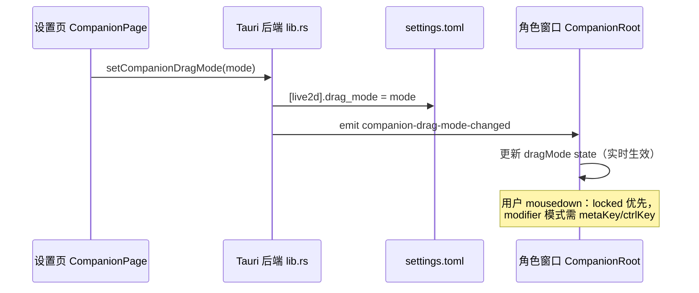

# 桌宠拖拽模式（直接拖动 / 修饰键拖动）技术方案设计

- 日期：2026-08-21
- 状态：设计已评审通过，待实施

## 1. 背景与目标

桌宠窗口当前支持「按住左键拖动移动窗口（位置锁定时禁止）」。用户希望移动模型支持两种模式：

| 模式 | 行为 | 默认 |
| --- | --- | --- |
| `direct`（直接拖动） | 未锁定时，鼠标按住 Live2D 模型即可移动（现状） | ✅ |
| `modifier`（修饰键拖动） | 必须按住 cmd（macOS）/ Ctrl（Windows、Linux）才能按住拖动 | |

切换入口仅放在设置页（CompanionPage），右键菜单与托盘菜单保持简洁。

## 2. 现状分析

拖拽由前端驱动，拦截点集中在一处（`src-tauri/frontend/src/components/CompanionRoot.tsx`）：

```tsx
onMouseDown={(e) => {
  if (e.button !== 0 || layer === "back" || locked) return;
  void getCurrentWindow().startDragging();
}}
```

关键有利因素：

1. **修饰键跨平台检测已有先例**：滚轮缩放（cmd/ctrl + 滚轮）使用 `e.metaKey || e.ctrlKey`，
   macOS cmd 与 Windows/Linux Ctrl 的差异已解决；
2. **配置持久化链路现成**：位置锁定（`locked`，PR #131）的完整链路可整体照抄——
   `settings.toml` 的 `[live2d]` 段 → Tauri command 写入 + emit 事件 → 前端订阅实时同步；
3. **旧配置兼容模式现成**：`Option<>` 字段 + 缺省值，旧版配置反序列化回退 `None` 已有测试先例。

## 3. 技术方案

### 3.1 配置模型（`src/config/settings.rs`）

`Live2dSettings` 新增字段：

```rust
pub drag_mode: Option<CompanionDragMode>,
```

新枚举（与 `CompanionWindowLayer` 同款 serde 模式）：

```rust
#[derive(Debug, Clone, Copy, PartialEq, Serialize, Deserialize)]
#[serde(rename_all = "lowercase")]
pub enum CompanionDragMode { Direct, Modifier }
```

- `None` → 视为 `direct`（现状行为），旧配置零迁移；
- 序列化产出 `drag_mode = "direct" | "modifier"`，`None` 不产出该键。

### 3.2 后端（`src-tauri/src/lib.rs`）

1. `Live2dConfigInfo` 结构体加 `drag_mode: Option<CompanionDragMode>` 字段，
   `get_live2d_config` 从 `live2d_settings` 透传（照抄 `locked`）；
2. 新增 `apply_companion_drag_mode(app, mode)`：写 `settings.toml` + emit
   `companion-drag-mode-changed`（照抄 `apply_companion_locked`）；
3. 新增 command `set_companion_drag_mode(app, mode)`，注册到 invoke_handler；
4. 右键菜单 / 托盘菜单不加入口（仅设置页）。

### 3.3 前端

**`lib/tauri.ts`**：封装 `setCompanionDragMode({ mode })` 与事件订阅
`onCompanionDragModeChanged(cb)`（照抄 `setCompanionLocked` / `onCompanionLockedChanged`）。

**`CompanionRoot.tsx`**：

1. 新增 `dragMode` state：启动时从 `config.drag_mode ?? "direct"` 恢复，
   订阅 `companion-drag-mode-changed` 实时同步；
2. mousedown 守卫加一行（锁定优先，模式判断在后）：

```tsx
if (e.button !== 0 || layer === "back" || locked) return;
if (dragMode === "modifier" && !(e.metaKey || e.ctrlKey)) return;
```

**`CompanionPage.tsx`**：锁定开关下方新增 Switch「按住 ⌘/Ctrl 才能拖动」，
描述文案说明与「锁定位置」的区别（锁定 = 完全不能拖；此开关 = 需按住修饰键才能拖）。

### 3.4 数据流



## 4. 边界行为（确认为正确语义，不需额外代码）

| 场景 | 行为 | 依据 |
| --- | --- | --- |
| 拖动开始后松开 cmd/ctrl | 拖动不中断 | `startDragging()` 已交还系统，符合原生窗口直觉 |
| 先按鼠标后按 cmd | 不触发拖动 | mousedown 时修饰键状态已定格 |
| cmd/ctrl + 滚轮 | 缩放（现状不变） | 按住修饰键时「拖 = 移动、滚 = 缩放」共存不冲突 |
| 锁定 + 按住修饰键拖动 | 不拖动 | `locked` 判断在模式判断之前，锁定优先 |
| 置底（back）层 | 点穿，不受影响 | 现有守卫 `layer === "back"` 在最前 |

## 5. 实施阶段与验收

单阶段实施（改动面小、无破坏性变更）：

| # | 任务 | 验收 |
| --- | --- | --- |
| 1 | `settings.rs`：枚举 + 字段 + 序列化/兼容测试 | `cargo test -p zapmomo settings` 通过；旧配置回退 `None` |
| 2 | `lib.rs`：command + 事件 + 配置透传 + 单测 | `cargo test -p zapmomo-app`；`cargo clippy -p zapmomo-app -- -D warnings` 无告警 |
| 3 | `tauri.ts` + `CompanionRoot.tsx`：API、state、守卫 | Vitest 用例通过（见 §6） |
| 4 | `CompanionPage.tsx`：设置开关 + 测试 | 开关切换调用 `setCompanionDragMode`，初始值从 config 恢复 |
| 5 | 全量检查 | `cargo fmt --check && cargo clippy -- -D warnings && cargo test` + 前端 `tsc -b` / Vitest 全绿 |

## 6. 测试计划

**Rust**（照抄 `locked` 的测试模式）：

- 序列化：`Some(Modifier)` 产出 `drag_mode = "modifier"`；`None` 不产出该键；
- 反序列化：旧配置（无字段）回退 `None`；
- `resolve_drag_mode(live2d: Option<&Live2dSettings>) -> CompanionDragMode` 缺省 / 读取行为
  （照抄 `resolve_locked`）。

**前端**（Vitest + Testing Library）：

- `CompanionRoot.test.tsx`：
  1. `direct` 模式裸 mousedown 触发 `startDragging`（现状回归）；
  2. `modifier` 模式裸 mousedown **不**触发；
  3. `modifier` 模式 + `metaKey`（及 `ctrlKey`）触发；
  4. `locked` 时即使按住修饰键也不触发（优先级）。
- `CompanionPage.test.tsx`：开关切换调用 `setCompanionDragMode`；初始值从 config 恢复。

## 7. 改动文件清单

| 文件 | 改动 |
| --- | --- |
| `src/config/settings.rs` | 枚举 `CompanionDragMode` + 字段 + 测试 |
| `src-tauri/src/lib.rs` | command / 事件 / 配置透传 + 单测 |
| `src-tauri/frontend/src/lib/tauri.ts` | API 封装 + 事件订阅 |
| `src-tauri/frontend/src/components/CompanionRoot.tsx` | state + mousedown 守卫 |
| `src-tauri/frontend/src/pages/CompanionPage.tsx` | 设置开关 |
| `src-tauri/frontend/src/components/CompanionRoot.test.tsx` | 交互用例 |
| `src-tauri/frontend/src/pages/CompanionPage.test.tsx` | 开关用例 |
