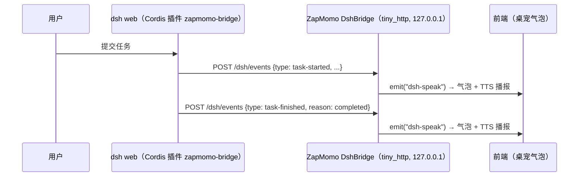

# ZapMomo × deepseek-harness 桌宠感知桥（dsh-bridge）设计

- 日期：2026-08-21
- 状态：已与用户逐节确认（5/5 节）
- 目标：ZapMomo 桌宠实时感知 [deepseek-harness](https://github.com/deepseek-ai/deepseek-harness)（dsh）的任务运行状态；任务开始/完成/失败时，Live2D 角色以文字气泡 + 语音播报对应台词

## 0. 需求结论（用户确认）

| 决策点 | 结论 |
| --- | --- |
| dsh 运行形态 | `dsh web` 常驻服务（127.0.0.1:3080） |
| 集成方向 | 方案 B：dsh 侧插件**主动推送**，ZapMomo 被动接收 |
| 推送语义 | **真推送**，非轮询（否决文件+轮询通道） |
| 台词生成 | 固定模板（每类事件 3~5 句随机挑），不走 LLM |
| 展示形态 | 文字气泡 + 语音播报（气泡不依赖语音） |
| 触发粒度 | 粗粒度：任务开始 / 完成 / 失败（+中断，避免误导） |
| 通用化 | 本期 dsh 专用；MCP 门面、Claude Code/Codex/飞书接入留待后续抽象（纯函数层已留缝） |

## 1. 总体架构：loopback HTTP 直推

ZapMomo 在 Tauri app 进程内起一个**仅绑 127.0.0.1 的极小 HTTP 服务**；dsh 侧薄 Cordis 插件在任务状态翻转瞬间 `POST` 语义化事件，毫秒级到达。



### 端口发现与鉴权（唯一的文件参与，只读、非轮询）

- 启动绑 `127.0.0.1:0`（随机端口，杜绝冲突；`[dsh].port` 可固定便于手测）
- 写 `~/.zapmomo/runtime/dsh-bridge.json` `{port, token}`，权限 0600；token 每次启动随机、**不进 settings**
- 退出删文件（best-effort），启动清陈旧残留
- dsh 插件每次 POST 前现读该文件；读不到 = ZapMomo 未运行，静默跳过

### 选型理由

- **为什么不用 UDS/named pipe**：ZapMomo 发布 Windows 包；loopback HTTP 三平台一致且 curl 可手测
- **为什么 tiny_http + std::thread 而非 axum**：现有监听线程全是 `running: AtomicBool + JoinHandle` 同步模式（`ListenState`），tiny_http 零异步接线、依赖极小；日后 MCP 门面需要 streamable-HTTP 再迁 axum，server 只是薄壳
- **信任边界**：loopback only + Bearer token，与 dsh 自身 API 同级

## 2. dsh 侧：Cordis 插件 zapmomo-bridge

独立微型插件包（不改 dsh 源码、不 fork）：

```
zapmomo-bridge/
├── package.json
└── src/index.ts   # ~60 行
```

挂载（二选一，实施时按 `docs/cookbook/extension-cookbook.md` 核对）：
`dsh plugin --profile web add <路径>` 或 `$DSH_HOME/profiles/web/cordis.patch.yml` 条目。

### 事件监听与映射

| Cordis 事件 | 触发 | 推送 |
| --- | --- | --- |
| `agent/status` | `idle → running` | `task-started` |
| `session/event`（过滤 `turn/end`） | `reason.kind = completed` | `task-finished` |
| 同上 | `reason.kind = error` | `task-failed` |
| 同上 | 其余（aborted/interrupted/max-tokens/blocked） | `task-interrupted` |

结束信号以 `turn/end` 为准（带原因），`agent/status` 只管开始，避免同一次结束推两条。

### POST 报文

```jsonc
POST http://127.0.0.1:<port>/dsh/events
Authorization: Bearer <token>
{
  "type": "task-failed",
  "sessionId": "abc123",
  "title": "修复登录超时",       // 可选：插件记录的该会话最近 user/message 摘要
  "reason": "error",            // 可选：turn/end 的 reason.kind 原文
  "detail": "LlmFailure: …",    // 可选：失败详情，截断 ~200 字符
  "time": 1755782400000
}
```

响应 204；ZapMomo 侧 serde 允许未知字段（前向兼容），未知 `type` 忽略并记日志。

### 插件纪律（不拖累宿主）

1. 每次发送前现读发现文件（ZapMomo 重启换端口能跟上）
2. POST 超时 1s，所有异常吞掉只打 debug 日志——插件永不阻塞 dsh 本体
3. v1 不做队列重试（桌宠没开事件即弃）

已否决备选：CC 兼容 hooks 桥（默认 bundle 不挂载、无 per-session 粒度、还要 hooks.json）。

## 3. ZapMomo Rust 侧

### 代码落位（仿 `src/kws/`：根 crate 放逻辑、src-tauri 放接线）

```
src/dsh/                      # 根 crate，纯逻辑 + server，全部可单测
├── mod.rs        # DshBridge：tiny_http + std::thread，run_with(cfg, sink)
├── event.rs      # DshEvent serde 类型（宽容解析）
├── config.rs     # [dsh] 段 resolve
└── lines.rs      # 模板台词表 + pick_line() 纯函数
src-tauri/src/lib.rs          # State + setup() 挂载 + commands + TTS/落盘
```

### 处理管线（sink 闭包内，纯函数化）

```
POST /dsh/events → 解析 DshEvent
  → 节流：同 (sessionId, type) 3s 内重复即弃
  → pick_line：按 type 查模板表；有 title 用带标题变体
  → 分发：
     ① app.emit("dsh-speak", {text, event})   // 气泡立即出，不等语音
     ② TTS 播报（[dsh].voice_enabled 且 voice 会话未运行时）
     ③ records::append_record 追加 assistant 记录（record_to_history 开关）
```

### TTS 播报与互斥

- voice 会话运行中（`is_voice_session_running`）→ 只气泡不出声，不打断对话
- 空闲时独立 announce 路径：后台线程 `TtsEngine` 合成内存 wav → 独立 rodio `OutputStream` 播放
- announce 防重叠：AtomicBool 哨兵 + Drop 释放；排队上限 1，溢出只留气泡
- 气泡与语音解耦：emit 即刻、合成异步跟上

### `[dsh]` 配置段（settings.toml）

```toml
[dsh]
enabled = true           # 桥服务开关
port = 0                 # 0=随机端口（默认）
voice_enabled = true     # 事件语音播报
record_to_history = true # 写入对话记录
```

Tauri commands：`get_dsh_config / set_dsh_enabled / set_dsh_params / get_dsh_bridge_status / test_dsh_announce`（patch 模式仿 `KwsParamsPatch::apply_to`）。

## 4. 前端

### 桌宠气泡（新建 `components/companion/EventBubble.tsx`）

- `CompanionRoot.tsx` 挂载；`onDshSpeak` 订阅 `"dsh-speak"`
- 同时最多 2 条堆叠，队列上限 3、溢出丢最旧；每条 8s 自动淡出
- 半透明深色圆角白字，最多 2 行截断（全文有对话记录兜底）
- **动作联动**：按事件类型触发 Live2D motion（finished→开心 / failed→难过 / started→打招呼），经 Live2dStage imperative API（`startMotion/setExpression`）；模型缺 motion 静默跳过
- 桌宠隐藏时 emit 无害

### 设置窗口新区块（「外部感知 / dsh 桥」）

总开关（停桥+删发现文件）、运行状态徽标（`onDshBridgeStatus` 事件 + command 兜底）、语音/落盘开关、「测试播报」按钮（`test_dsh_announce` 灌假事件全链路验收）。

### 接线（tauri.ts）

listen：`onDshSpeak / onDshBridgeStatus`；command：`getDshConfig / setDshEnabled / setDshParams / getDshBridgeStatus / testDshAnnounce`。`dsh-speak` 只由 CompanionRoot 消费。

## 5. 错误处理、测试、分期实施

### 错误处理矩阵（原则：不拖垮本体；语音不阻塞气泡）

| 场景 | 行为 |
| --- | --- |
| 固定端口被占 | 回退随机端口 + warn；随机也失败 → 桥 failed + emit 状态，app 不受影响 |
| 发现文件写失败 | 桥照跑 + emit 错误状态（设置页可见） |
| token 不符 / body>64KB / 坏 JSON | 401 / 413 / 400；未知字段忽略、未知 type 忽略+debug |
| 事件风暴 | (sessionId, type) 3s 节流去重 |
| TTS 模型未下载/合成失败 | 气泡照出，语音跳过 + warn |
| voice 会话运行中 | 只气泡不出声 |
| app 退出/启动 | 退出删发现文件；启动清陈旧残留 |
| dsh 插件侧异常 | 静默 debug；payload 字段防御性取值，缺失降级通用台词 |

### 测试策略

- Rust 单测（`src/dsh/` 内嵌，`run_with_temp_home` + `--test-threads=1`）：serde 宽容解析、`pick_line` 全类型、节流（同 key 去重/跨 key 不影响/超窗恢复）
- Rust 集成测：`run_with(port=0, mpsc sink)` 起真 server，断言 204/401/400 与 sink 事件
- 前端 Vitest：EventBubble 渲染/堆叠/8s 淡出（fake timers）、设置区块 invoke 参数
- 端到端手测：curl 三例（有效/错 token/voice 会话中）、设置页按钮、dsh 真任务三场景、ZapMomo 关闭 dsh 照跑
- CI：`cargo fmt --check && cargo clippy -- -D warnings && cargo test` + vitest

### 分期实施与验收

| 阶段 | 内容 | 验收 |
| --- | --- | --- |
| **1. 桥+气泡** | `src/dsh/` 全模块+单测；src-tauri State/setup/commands/发现文件；EventBubble+接线 | curl POST→气泡 8s 消失；错 token 401；三件套绿 |
| **2. 语音+落盘+设置页** | announce 线程（互斥+排队 1）；`record_to_history`；设置区块+`test_dsh_announce` | 测试按钮全链路；voice 会话中只气泡；TTS 缺失只气泡 |
| **3. dsh 插件+联调** | zapmomo-bridge 插件+挂载；**先 log-only 版核对 cordis 事件 payload** | dsh 真任务三场景说话；ZapMomo 关闭 dsh 无感 |

### 未来扩展缝

事件解析/台词/节流纯函数 + sink 闭包隔离；后续 Claude Code（hooks→curl）、Codex（notify→curl）、飞书（connector 连出）只需新事件源，管线与展示层复用；MCP 门面二期再议（届时 server 迁 axum）。
